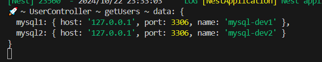
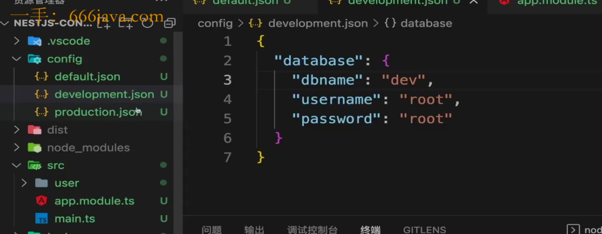
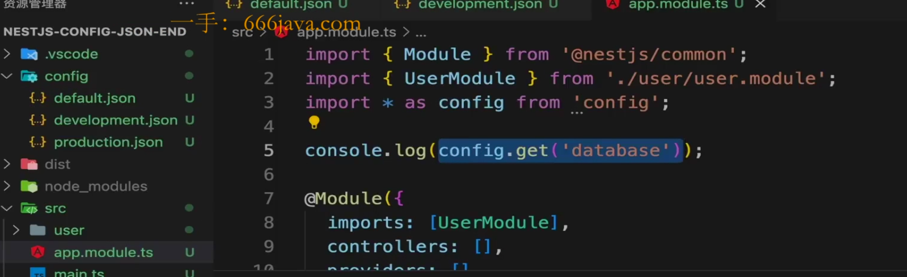
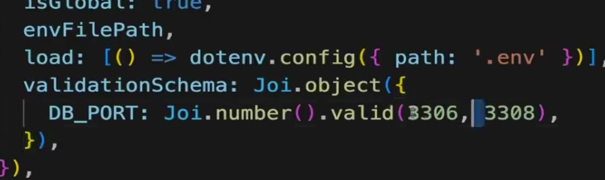

# 官方方案配置

@nestjs/config是一个用于配置管理的模块，它帮助你在NestJS应用中加载和管理配置文件或者环境变量。

通过这个模块，你可以轻松地使用环境配置变量配置应用程序的行为，支持多种环境(开发、生产)，以及集中化管理配置数据。

## @nestjs/config的用途

### 1.加载环境变量

`@nestjs/config`可以从.env文件或者环境变量中加载配置。这样你就可以根据环境变量来动态地调整应用的配置，而无需每个文件进行硬编码，写在代码里面：
比如创建一个.env文件:

```makefile
DATABASE_HOST=localhost
DATABASE_PORT=5432
```

然后在代码中通过 `ConfigService`来获取这些变量。

```ts
import {ConfigService} from '@nestjs/config'
@Injectable()
export class AppService{
    constructor(private configService:ConfigService){}
    
    getDatabaseHost():string{
        return this.configService.get<string>('DATABASE_HOST')
    }
    getDatabasePort():number{
        return this.configService.get<number>('DATABASE_PORT')
    }
}

```

user.controller.ts

```typescript
import { Controller, Get, Post, Query } from '@nestjs/common';
import { UserService } from './user.service';
import { ConfigService } from '@nestjs/config';
@Controller('user')
export class UserController {
  constructor(
    private userService: UserService,
    private configSerivce: ConfigService,
  ) {
    // 等价于this.userService = new UserService();
  }
  @Get()
  getUsers(@Query('num') num: number): any {
    const db = this.configSerivce.get('DB');
    console.log('🚀 ~ UserController ~ getUsers ~ db:', db);

    if (num == 5) {
      return this.userService.getUsers();
    }
    return { message: 'Invalid number' };
  }
  @Post()
  addUsers(): any {
    return this.userService.addUser();
  }
}

```


TypeScript 的类型注解（`ConfigService: ConfigService`）允许 NestJS 框架通过**反射（reflection）机制**推断出你需要的依赖类型。在编译时，NestJS 使用 **TypeScript 的装饰器**和**元数据**功能，来自动识别和管理依赖关系。以下是这个过程的简要描述：

- **当你使用 `@Injectable()` 装饰器声明服务时，NestJS 会将这个类注册为提供者。**
- 当你在构造函数中使用 `private configService: ConfigService`，**TypeScript 会将 `ConfigService` 的元数据附加到这个类上。**
- NestJS 利用这些元数据来了解应该注入哪个类的实例，进而提供依赖。

- **依赖注入** 是 NestJS 核心设计模式之一，它允许你在类中通过构造函数注入所需的服务（例如 `ConfigService`）。
- **`ConfigService`** 作为由 `ConfigModule` 提供的服务类，会在应用初始化时自动实例化并注册为依赖。
- 通过 **类型注解** 和 **元数据反射**，NestJS 知道在构造函数中应该为 `ConfigService` 注入一个实际的服务实例，从而实现自动化依赖管理。

因此，`configService: ConfigService` 能够接受一个服务类，是因为 NestJS 框架在幕后利用了依赖注入机制，将 `ConfigService` 实例自动注入到类中。

### 2.配置全局使用

通过ConfigModule，你可以设置配置为全局模块，不用在每个模块中单独导入。

```ts
@Module({
    imports:[
        ConfigModule.forRoot({
            isGlobal:true,
        })
    ]
})
export class AppModule{}
```

app.module.ts
```ts
import { Module } from '@nestjs/common';
import { UserModule } from './user/user.module';
import { ConfigModule } from '@nestjs/config';
@Module({
  imports: [
    ConfigModule.forRoot({
      isGlobal: true,
    }),
    UserModule,
  ],
  controllers: [],
  providers: [],
})
export class AppModule {}

```

这样你就可以在应用的任何地方使用ConfigService,而不需要手动导入ConfigModule。

当然，如果你选择在user.module.ts里面进行ConfigModule.forRoot的配置，一样是可以在user.controller.ts中使用的。

### 3. **支持不同的环境配置**

你可以为不同的环境（开发、生产、测试）提供不同的配置文件，`@nestjs/config` 允许你加载不同的 `.env` 文件：

```bash
.env               # 默认配置
.env.development   # 开发环境配置
.env.production    # 生产环境配置
.env.test          # 测试环境配置
```

通过 `NODE_ENV` 环境变量指定当前运行环境时，`@nestjs/config` 会自动加载相应的 `.env` 文件。

### 4. **自定义配置文件**

除了加载环境变量，你还可以自定义配置。例如，可以通过 `ConfigModule.forRoot()` 传递配置对象：

```typescript
import { Module } from '@nestjs/common';
import { ConfigModule } from '@nestjs/config';

const configuration = () => ({
  port: parseInt(process.env.PORT, 10) || 3000,
  database: {
    host: process.env.DATABASE_HOST,
    port: parseInt(process.env.DATABASE_PORT, 10) || 5432,
  },
});

@Module({
  imports: [
    ConfigModule.forRoot({
      load: [configuration], // 加载自定义配置
    }),
  ],
})
export class AppModule {}
```

### 5. **类型安全**

`@nestjs/config` 可以与 TypeScript 类型系统集成，提供类型安全的配置管理。你可以为配置定义接口，使得在获取配置项时有类型提示。

```typescript
interface AppConfig {
  port: number;
  database: {
    host: string;
    port: number;
  };
}

@Injectable()
export class AppService {
  constructor(private configService: ConfigService<AppConfig>) {}

  getDatabaseHost(): string {
    return this.configService.get('database.host');
  }
}
```


### ConfigModule.forRoot配置

我们可以通过envFilePath设置我们自定义的环境变量，但是我们需要先在根目录创建一个自定义环境变量，比如.env.development。

同时我们可以通过安装cross-env插件，使得我们可以在脚本通过pnpm run start:dev执行cross-env脚本，请注意，NODE_ENV注入变量是通过package.json来实现的:
```JSON
  "start:dev": "cross-env NODE_ENV=development nest start --watch",
    "start:prod": "cross-env NODE_ENV=production node dist/main",

```

同时务必要在ConfigModule.forRoot的全局配置中读取`process.env.NODE_ENV`设置的具体env名称:

app.module.ts

```typescript
import { Module } from '@nestjs/common';
import { UserModule } from './user/user.module';
import { ConfigModule } from '@nestjs/config';

const envFilePath = `.env.${process.env.NODE_ENV || 'development'}`;

@Module({
  imports: [
    ConfigModule.forRoot({
      isGlobal: true,
      // 区分环境变量
      envFilePath,
    }),
    UserModule,
  ],
  controllers: [],
  providers: [],
})
export class AppModule {}

```

接下来在user.controller.ts中输出对应的结果即可:
```ts
    const db = this.configSerivce.get(ConfigEnum.DB);
    console.log('🚀 ~ UserController ~ getUsers ~ db:', db);
```

如果你期望手动指定读取环境文件，比如.env，那么可以通过load结合dotenv来实现:
```ts
@Module({
  imports: [
    ConfigModule.forRoot({
      isGlobal: true,
      // 区分环境变量
      envFilePath,
      // 这里的load是为了实现
      load: [() => dotenv.config({ path: '.env' })],
    }),
    UserModule,
  ],
  controllers: [],
  providers: [],
})
```

`oad: [() => dotenv.config({ path: '.env' })]` 这一部分代码的作用是加载 `.env` 文件的配置。这么做的目的是为了手动载入 `.env` 文件的内容并将其作为环境变量。

具体解释如下：

1. **dotenv.config({ path: '.env' })**:
   - `dotenv` 是一个用于从 `.env` 文件中加载环境变量的库。默认情况下，它会自动读取项目根目录下的 `.env` 文件。
   - `dotenv.config({ path: '.env' })` 这段代码明确指定了要加载的文件路径为 `.env`，确保在没有指定 `NODE_ENV` 时，默认读取根目录下的 `.env` 文件。
2. **load 选项**:
   - NestJS 的 `ConfigModule` 支持 `load` 选项，允许通过加载函数的方式来载入配置。`load` 中传入的函数会在 `ConfigModule` 初始化时被执行。
   - 在这个例子中，`load` 选项中传入了 `() => dotenv.config({ path: '.env' })`，这确保了即使没有明确地通过 `envFilePath` 指定 `.env` 文件路径，它也会手动从根目录下加载 `.env` 文件。

#### load主要用途：

当使用不同的 `.env` 文件来管理多个环境（如 `.env.development`、`.env.production`）时，通常通过 `envFilePath` 来选择加载的文件。然而，为了确保在没有 `NODE_ENV` 时，能够加载默认的 `.env` 文件，这里手动指定了 `.env` 路径。这种方法提供了一个冗余的安全措施，确保根目录的 `.env` 文件总是被加载。

### 简单总结：

- `load: [() => dotenv.config({ path: '.env' })]` 的作用是手动加载默认的 `.env` 文件，从而确保在不同的环境中都能正确加载根目录下的 `.env` 配置。


## js-yaml

首先执行安装`pnpm add js-yaml`。 

然后安装对应的types文件:

`pnpm i -D @types/js-yaml`

我们创建一个ts文件，用于专门读取和导出yaml文件:


```typescript
import { readFileSync } from 'fs';
import * as yaml from 'js-yaml';
import { join } from 'path';

const YAML_CONFIG_FILENAME = 'config.yaml';
const filePath = join(
  __dirname,
  '../../nest-config-start/config/',
  YAML_CONFIG_FILENAME,
);
console.log('YAML file path:', filePath);

// 这里采用了函数的形式到处，是因为ConfigModule有一个load方法，它会导出一个函数
export default () => {
  return yaml.load(readFileSync(filePath, 'utf8'));
};

```

然后我们变更读取文件的方式，不再读取.env文件，而是转而去获取yaml文件:

app.module.ts

```typescript
import { Module } from '@nestjs/common';
import { UserModule } from './user/user.module';
import { ConfigModule } from '@nestjs/config';
// import * as dotenv from 'dotenv';
import configuration from './configuration';
// const envFilePath = `.env.${process.env.NODE_ENV || 'development'}`;

@Module({
  imports: [
    ConfigModule.forRoot({
      isGlobal: true,
      // 区分环境变量
      // envFilePath,
      // 这里的load是为了实现
      // load: [() => dotenv.config({ path: '.env' })],
      // .env被读取的优先级更高，如果你想避免读取env，请配置:
      envFilePath: 'no-env-file.env', // 设置为一个无效的路径，确保不会加载实际的 .env 文件

      load: [configuration],
    }),
    UserModule,
  ],
  controllers: [],
  providers: [],
})
export class AppModule {}

```

### 使用yaml的意义

.env、.env.production、.env.development都存在一个问题，那就是共有属性无法单独集中在.env配置，避免重复配置。

但是yaml可以很好的实现这一点:

.config.dev.yaml

```yaml
db:
  mysql1:
    name: mysql-dev

  mysql2:
    name: mysql-dev

```

.config.prod.yaml
```yaml
db:
  mysql1:
    name: mysql-prod

  mysql2:
    name: mysql-prod

```

.config.yaml

```yaml
db:
  mysql1:
    host: 127.0.0.1
    name: mysql-dev
    port: 3306

  mysql2:
    host: 127.0.0.1
    name: mysql-prod
    port: 3306

```

然后我们在configuration.ts的yaml读取配置中，指定common的yaml文件:

```typescript
const YAML_COMMON_CONFIG_FILENAME = 'config.yaml';
const filePath = join(
  __dirname,
  '../../nest-config-start/config/',
  YAML_COMMON_CONFIG_FILENAME,
);
```

最终利用lodash合并文件:

```typescript
import { readFileSync } from 'fs';
import * as yaml from 'js-yaml';
import { join } from 'path';
import * as _ from 'lodash';
const YAML_COMMON_CONFIG_FILENAME = 'config.yaml';
const filePath = join(
  __dirname,
  '../../nest-config-start/config/',
  YAML_COMMON_CONFIG_FILENAME,
);
const envPath = join(
  __dirname,
  '../../nest-config-start/config/',
  `config.${process.env.NODE_ENV || 'development'}.yaml`,
);
const prodPath = join(
  __dirname,
  '../../nest-config-start/config/',
  `config.${process.env.NODE_ENV || 'production'}.yaml`,
);
const commonConfig = yaml.load(readFileSync(filePath, 'utf8'));
const envConfig = yaml.load(readFileSync(envPath, 'utf8'));
const prodConfig = yaml.load(readFileSync(prodPath, 'utf8'));

// 这里采用了函数的形式到处，是因为ConfigModule有一个load方法，它会导出一个函数
export default () => {
  // 利用lodash方法合并文件
  return _.merge(commonConfig, envConfig);
};

```

刷新浏览器，就可以读取到对应的commonConfig和envConfig的混合结果了:


如果存在重合的属性，那么默认的common公共文件的属性会被优先读取。


## json

json文件其实也是同理，只需要在app.module.ts中，使用`config.get(读取指定属性)`,就可以正常读取文件。

同样，采用development.json和production.json同样可以实现配置合并，并且我们无需借助`_.merge()`手动地进行配置合并。

前提取决于你应用cross-env选取的NODE_ENV是development还是production，从而使得common文件和对应环境的文件配置合并：



app.module.ts:

```typescript
import { Module } from '@nestjs/common';
import { UserModule } from './user/user.module';
import * as config from 'config';

console.log(config.get('database'));
@Module({
  imports: [
    UserModule,
  ],
  controllers: [],
  providers: [],
})
export class AppModule {}

```





## 校验配置文件

 

我们可以采用joi来进行文件配置的校验是否正确，首先我们先安装joi:

```typescript
pnpm add --save joi
```

我们同样在app.module.ts中进行测试:

```typescript
import { Module } from '@nestjs/common';
import { UserModule } from './user/user.module';
import { ConfigModule } from '@nestjs/config';
import * as dotenv from 'dotenv';
// import configuration from './configuration';
import * as Joi from 'joi';
const envFilePath = `.env.${process.env.NODE_ENV || 'development'}`;

@Module({
  imports: [
    ConfigModule.forRoot({
      isGlobal: true,
      // 区分环境变量
      envFilePath,
      // 这里的load是为了实现
      load: [() => dotenv.config({ path: '.env' })],
      // .env被读取的优先级更高，如果你想避免读取env，请配置:
      // envFilePath: 'no-env-file.env', // 设置为一个无效的路径，确保不会加载实际的 .env 文件

      // load: [configuration],
      // joi配置校验
      validationSchema: Joi.object({
        DB_PORT: Joi.number().default(3306),
      }),
    }),
    UserModule,
  ],
  controllers: [],
  providers: [],
})
export class AppModule {}

```

validationSchema就是用于进行配置参数的校验的，通常你也可以把3306设置为一个多个数字，只要是数组范围内的数字就可以通过校验。



同样，我们也可以对NODE_ENV，以及其它参数进行校验:

```typescript
    validationSchema: Joi.object({
        DB_PORT: Joi.number().default(3306),
        NODE_ENV: Joi.string()
          .valid('development', 'production')
          .default('development'),
        DB_URL: Joi.string().domain(),
        DB_HOST: Joi.string().ip(),
      }),
```

我们通常采用 `Joi.类型().默认值/校验/指定类型`的方式进行具体的校验。

具体的配置的规则需要在官方文档上面去查阅即可。
