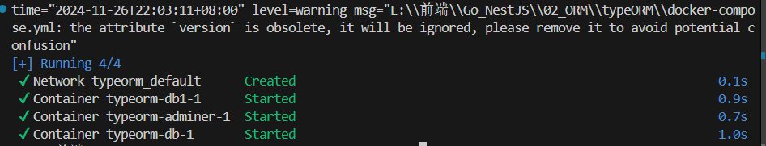
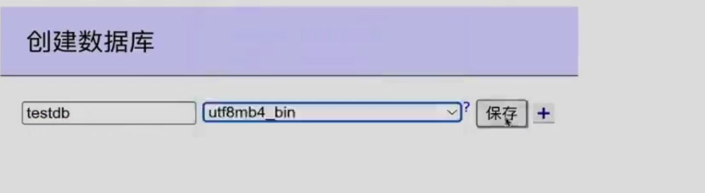
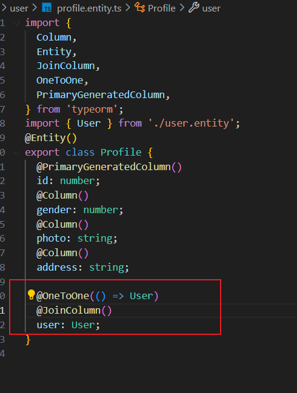
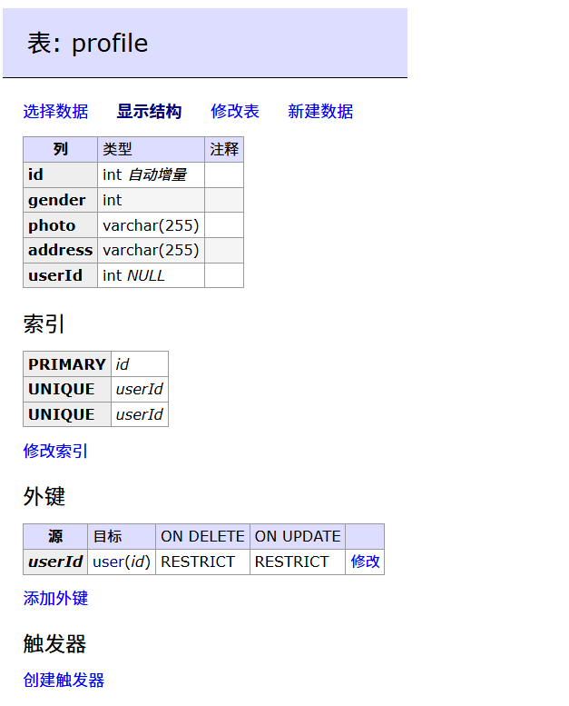

# TypeOrm

## docker配置

这一章我大概学会了咋配docker。

**为什么使用 Docker？**

- Docker 是一个容器化平台，能够在隔离的环境中运行应用程序，包括数据库、API 服务等。
- 它的核心优势是：
  - **环境一致性**：不管是在本地、测试环境还是生产环境，Docker 都能提供一致的运行环境。
  - **隔离性**：每个服务（如数据库和 Nest 应用）运行在独立的容器中，互不干扰。
  - **快速部署**：容器可以通过镜像快速启动，省去了复杂的安装过程。

首先在nestjs项目中的app.controller.ts中进行TypeOrmModule的配置，通过configService来获取ConfigEnum的参数。

```typescript
import { Module } from '@nestjs/common';
import { UserModule } from './user/user.module';
import { ConfigModule, ConfigService } from '@nestjs/config';
import * as dotenv from 'dotenv';
// import configuration from './configuration';
import * as Joi from 'joi';
import { TypeOrmModule } from '@nestjs/typeorm';
import { ConfigEnum } from './enum/config.enum';
import { User } from './user/user.entity';
const envFilePath = `.env.${process.env.NODE_ENV || 'development'}`;

@Module({
  imports: [
    ConfigModule.forRoot({
      isGlobal: true,
      // 区分环境变量
      envFilePath,
      // 这里的load是为了实现
      load: [() => dotenv.config({ path: '.env' })],
      // .env被读取的优先级更高，如果你想避免读取env，请配置:
      // envFilePath: 'no-env-file.env', // 设置为一个无效的路径，确保不会加载实际的 .env 文件

      // load: [configuration],
      // joi配置校验
      validationSchema: Joi.object({
        DB_PORT: Joi.number().default(3306),
        NODE_ENV: Joi.string()
          .valid('development', 'production')
          .default('development'),
        DB_URL: Joi.string().domain(),
        DB_HOST: Joi.string().ip(),
      }),
    }),
    UserModule,
    // 配置typeormmodule模块
    /*     TypeOrmModule.forRoot({

    }), */
    TypeOrmModule.forRootAsync({
      imports: [ConfigModule],
      inject: [ConfigService],
      useFactory: (configService: ConfigService) => ({
        type: 'mysql',
        host: configService.get(ConfigEnum.DB_HOST),
        port: configService.get(ConfigEnum.DB_PORT),
        username: configService.get(ConfigEnum.DB_USERNAME),
        password: configService.get(ConfigEnum.DB_PASSWORD),
        database: configService.get(ConfigEnum.DB_DATABASE),
        entities: [User],
        // 同步本地的schema与数据库
        synchronize: true, // 自动创建表
        logging: ['error'], // 打印sql日志
      }),
    }),
  ],
  controllers: [],
  providers: [],
})
export class AppModule {}

```

`TypeOrmModule.forRootAsync` 是 `@nestjs/typeorm` 模块提供的一种异步配置方式，用于初始化 TypeORM 模块。

它允许在运行时动态加载数据库配置，尤其适用于需要从环境变量、配置服务或其他异步资源中获取配置信息的场景。

### 1. **异步加载配置**

- **目的**：允许在运行时动态生成数据库连接配置，而不是在编译时硬编码。
- **使用场景**：需要从环境变量或配置服务中读取数据库配置时非常有用。
- **作用**：通过 `useFactory` 方法返回的配置信息，动态地初始化 TypeORM。

------

### 2. **支持依赖注入**

- **特点**：通过 `inject` 选项，您可以注入服务（例如 `ConfigService`）来获取动态配置。
- 好处
  - 将数据库配置与代码逻辑解耦。
  - 可以复用已有的服务（例如读取 `.env` 文件的服务）。

------

### 3. **支持模块间依赖**

- `imports` 选项允许引入其他模块，以确保在生成配置时能够访问这些模块中导出的服务。

------

### 配置解析流程

在您的代码中，`TypeOrmModule.forRootAsync` 的具体配置如下：

1. **`imports`**:

   - 导入了 `ConfigModule`，提供了全局的配置管理能力。

2. **`inject`**:

   - 注入 `ConfigService`，用来读取和解析 `.env` 文件中的数据库配置信息。

3. **`useFactory`**:

   - 一个工厂函数，用于动态生成 TypeORM 的配置。

   - 功能

     ：

     - 从 `ConfigService` 获取数据库配置，例如主机、端口、用户名、密码等。
     - 设置 `entities` 为包含 `User` 实体的数组，用于同步表结构。
     - 设置 `synchronize: true`，在开发环境中自动同步数据库 schema。

### 创建数据库&&利用typeorm建表

在开始之前，你需要借助docker-compose.yml配置docker，然后再通过docker容器启动对应的服务器，再利用nest访问。

首先你需要配置docker-compose.yml:
```yaml
# Use root/example as user/password credentials
version: '3.1'

services:
  db:
    image: mysql:8.0
    restart: always
    environment:
      MYSQL_ROOT_PASSWORD: Code+2
    ports:
      - 3306:3306

  db1:
    image: mysql:8.0
    restart: always
    environment:
      MYSQL_ROOT_PASSWORD: Code+3
      MYSQL_DATABASE: a1
    ports:
      - 3307:3306

  adminer:
    image: adminer
    restart: always
    ports:
      - 8080:8080
```

然后利用 `docker-compose up -d`启动docker容器，你也可以使用 `docker-compose down `关闭所有docker的服务。

注意3306接口可能本地Mysql会占用，你应该先关闭该进程，再启用docker容器。



当所有服务器亮起绿灯，然后你再利用adminer的port进行本地服务器的获取,比如localhost:8080，就可以进入docker登录页面了。

注意我这里的docker服务器用的是db，不是本地回环地址，所以登录服务器要写db。

如果你从来没有用docker创立过服务器，a1是不生效的，需要你手动创建a1。

创建的时候注意选择utf8mb4_bin格式的数据库:


然后在user.entity.ts里面写好对应的数据库的配置:

```typescript
import { Entity, PrimaryGeneratedColumn, Column } from 'typeorm';

@Entity()
export class User {
  @PrimaryGeneratedColumn()
  id: number;
  @Column()
  username: string;
  @Column()
  password: string;
}

```

再启动一次`pnpm run start:dev`，你就会发现docker自动创建了一个名为User的表，里面的主键和列都写好啦~

## docker答疑

### docker配置文件

1. **为什么用 `docker-compose.yml` 文件？**

   ```ts
   # Use root/example as user/password credentials
   version: '3.1'
   
   services:
     db:
       image: mysql:8.0
       restart: always
       environment:
         MYSQL_ROOT_PASSWORD: Code+2
       ports:
         - 3306:3306
   
     db1:
       image: mysql:8.0
       restart: always
       environment:
         MYSQL_ROOT_PASSWORD: Code+3
         MYSQL_DATABASE: a1
       ports:
         - 3307:3306
   
     adminer:
       image: adminer
       restart: always
       ports:
         - 8080:8080
   ```

   

   - `docker-compose.yml` 是一个编排工具，用于定义和运行多个 Docker 容器。
   - 在你的场景中：
     - 配置了 MySQL 数据库服务 (`db`)。
     - 配置了 Adminer 服务（一个 MySQL 管理工具）。
     - 使用 Compose 文件可以一次性启动这些服务，方便管理和维护。

2. **Docker 容器和 NestJS 的关系**

   - Docker 容器中运行的是 MySQL 数据库服务（`db`），它负责存储数据。
   - NestJS 是你的应用程序，它需要连接到数据库才能完成 CRUD 操作。
   - 因为 MySQL 运行在 Docker 容器中，NestJS 需要通过容器的网络来访问 MySQL。

------

### 中间的流程

1. **定义 Docker 服务**
   - 你在 `docker-compose.yml` 文件中定义了 MySQL 和 Adminer 服务，包括端口、用户名、密码等配置。
   - 通过 `docker-compose up -d` 命令，Docker 会根据这个文件拉取镜像并启动对应的服务。
2. **运行 MySQL 容器**
   - 启动后，MySQL 数据库运行在 Docker 容器中，暴露的端口（如 3306）被映射到宿主机。
   - 你可以通过 MySQL 客户端工具（如 Adminer 或 Navicat）连接到 MySQL，管理数据库。
3. **NestJS 应用连接数据库**
   - NestJS 使用 TypeORM 或类似工具，通过 `.env` 文件中的配置（如主机、端口、用户名、密码）连接到 MySQL 数据库。
   - **注意**：这里的主机地址通常是 Docker 内的服务名（如 `db`）或者宿主机的 IP 地址。
4. **启动 Nest 应用**
   - 启动后，NestJS 会根据 TypeORM 的配置尝试连接到 MySQL。
   - 如果连接成功，NestJS 可以对数据库执行操作，例如创建表或查询数据。

------

### 为什么要分成这么多步骤？

1. **环境隔离**
   - Docker 将数据库和其他服务与宿主机环境隔离，避免版本冲突（例如多个 MySQL 版本）。
2. **方便扩展**
   - 如果你以后需要添加 Redis、MongoDB 等其他服务，只需要修改 `docker-compose.yml`，可以方便地扩展系统。
3. **部署一致性**
   - Docker Compose 文件可以直接复制到服务器，确保开发环境和生产环境一致。
4. **易于调试**
   - Adminer 等工具运行在 Docker 中，可以快速验证数据库配置是否正确。

------

### 你的流程总结

1. **通过 `docker-compose.yml` 启动服务**
   - 定义 MySQL 数据库和管理工具（Adminer）的容器配置。
   - 一键启动所有服务。
2. **验证数据库是否启动**
   - 通过 Adminer 或 Navicat，检查 MySQL 是否正常工作。
3. **配置 NestJS 应用**
   - 在 `.env` 文件中配置数据库的连接信息（主机、端口、用户名等）。
   - 启动 NestJS，确保可以连接到数据库。
4. **应用开发和调试**
   - 使用 TypeORM 或其他工具开发业务逻辑，测试是否能正常读取或写入数据库。

------

### 示例：你的配置如何运作？

- **docker-compose.yml** 定义了 MySQL 数据库：
  - 数据库服务的端口映射为 `3306`。
  - 容器中的数据库初始化完成后，NestJS 应用可以通过端口 `3306` 访问数据库。
- **NestJS**：
  - 使用 `TypeOrmModule` 读取 `.env` 文件中的配置，尝试连接 `127.0.0.1:3306`。
  - 如果连接成功，TypeORM 会自动创建数据库表。

------

### 为什么不直接在本地运行 MySQL？

1. **版本冲突**：
   - 不同项目可能需要不同版本的 MySQL，很容易发生冲突。
   - Docker 提供了独立的运行环境，避免这种问题。
2. **配置复杂性**：
   - 手动安装 MySQL 需要配置用户、权限等，Docker 提供了快速启动的方法。
3. **一致性**：
   - 如果以后要部署到服务器，用 Docker 可以确保开发环境和生产环境完全一致。

------

### 总结

- **Docker 的核心价值**：隔离环境、快速启动、易于部署。
- **`docker-compose.yml` 的作用**：用作多容器服务的配置文件，管理数据库等服务。
- **NestJS 的作用**：通过数据库连接，构建你的应用逻辑。
- 这种流程适合开发复杂的分布式应用，虽然初期配置稍复杂，但长期来看对维护和扩展非常有利。


# 表的映射关系

## 一对一映射



通过`@oneToOne(()=>User)`建立一对一表单的映射关系，并且通过`@JoinColumn()`字段插入表。



这个字段可以创建一个关联关系，userId是根据typeorm根据`@JoinColumn()`默认创建的，它只会找到User表进行默认拼接，尚未形成关键的键的映射关系。

你可以通过直接定义userId的key来设置键名:

```ts
  @OneToOne(() => User)
  @JoinColumn({ name: 'uid' })
  user: User;
```

`() => User`使用函数调用，类似于按需调用，无需初始化，根据需要定义具体的表。

typeorm使用了非常多的注解实现了表的映射关联，比如`user:User`实际上就是表实例的注入，要求和User产生了强关联。


## 多对一映射/一对多映射

### **`logs.entity.ts`**

定义了 `Logs` 实体，描述日志记录的结构。

```ts
@Entity()
export class Logs {
  @PrimaryGeneratedColumn()
  id: number; // 日志的唯一标识（主键，自动生成）

  @Column()
  path: string; // 请求路径

  @Column()
  methods: string; // HTTP 方法 (如 GET, POST 等)

  @Column()
  data: string; // 请求数据

  @Column()
  result: number; // 请求返回的结果状态或代码

  @ManyToOne(() => User, (user) => user.logs) // 定义多对一关系
  @JoinColumn() // 指定这是一个外键
  user: User; // 关联到 User 实体
}
```

#### 外键部分详解：

- **`@ManyToOne(() => User, (user) => user.logs)`**
  - 这是一个多对一的关系：一个日志记录 (`Logs`) 必须属于一个用户 (`User`)。
  - 参数解释：
    - `() => User`: 定义关联到的目标实体是 `User`。
    - `(user) => user.logs`: 反向关联，在 `User` 实体中定义了 `logs` 属性表示一个用户拥有多个日志。
- **`@JoinColumn()`**
  - 告诉 TypeORM，这里的 `user` 属性是外键。
  - 会在 `Logs` 表中创建一个 `userId` 字段，存储对应的用户 ID。

------

### **`user.entity.ts`**

定义了 `User` 实体，描述用户数据的结构。

```ts
@Entity()
export class User {
  @PrimaryGeneratedColumn()
  id: number; // 用户的唯一标识（主键，自动生成）

  @Column()
  username: string; // 用户名

  @Column()
  password: string; // 用户密码

  @OneToMany(() => Logs, (logs) => logs.user) // 定义一对多关系
  logs: Logs[]; // 一个用户可以拥有多个日志记录
}
```

#### 外键部分详解：

- **`@OneToMany(() => Logs, (logs) => logs.user)`**
  - 这是一个一对多的关系：一个用户 (`User`) 可以拥有多个日志记录 (`Logs`)。
  - 参数解释：
    - `() => Logs`: 定义关联到的目标实体是 `Logs`。
    - `(logs) => logs.user`: 反向关联，表示 `Logs` 表中的 `user` 属性定义了属于哪一个用户。
- **外键关系的存储：**
  - `@OneToMany` 本身不会在 `User` 表中创建字段。
  - 外键字段 (`userId`) 是在 `Logs` 表中定义的，由 `@ManyToOne` 和 `@JoinColumn()` 控制。

------

### **外键关系的完整解析**

1. **数据库层面：**
   - 在 `Logs` 表中会生成一个外键字段 `userId`，它指向 `User` 表的 `id` 字段。
   - 在 TypeORM 中，**外键字段的生成是自动化的**，当你在实体中定义了一个关联关系（例如 `@ManyToOne`），并使用了 `@JoinColumn()` 时，TypeORM 会根据约定自动生成外键字段的名称。
   - 每条日志记录 (`Logs`) 的 `userId` 表示这条日志属于哪一个用户。
2. **实体层面的交互：**
   - 在 `Logs` 实体中，可以通过 `user` 属性访问日志对应的用户信息。
   - 在 `User` 实体中，可以通过 `logs` 属性访问用户的所有日志记录。
3. **关系的 Cardinality (基数)：**
   - **多对一 (`@ManyToOne`)：** 每条日志记录 (`Logs`) 必须且仅能关联一个用户 (`User`)。
   - **一对多 (`@OneToMany`)：** 每个用户 (`User`) 可以关联多条日志记录 (`Logs`)。

------

### **关系的代码示例**

假设我们有以下数据：

- 用户表 (`User`)：

  | id   | username | password  |
  | ---- | -------- | --------- |
  | 1    | alice    | password1 |
  | 2    | bob      | password2 |

- 日志表 (`Logs`)：

  | id   | path          | methods | data  | result | userId |
  | ---- | ------------- | ------- | ----- | ------ | ------ |
  | 1    | /api/login    | POST    | {...} | 200    | 1      |
  | 2    | /api/register | POST    | {...} | 201    | 1      |
  | 3    | /api/logout   | GET     | {...} | 200    | 2      |

查询操作：

- 从 

  ```
  Logs
  ```

   中访问对应用户：

  ```typescript
  const log = await logsRepository.findOne({ id: 1 }, { relations: ['user'] });
  console.log(log.user.username); // alice
  ```

- 从 

  ```
  User
  ```

   中获取所有日志：

  ```typescript
  const user = await userRepository.findOne({ id: 1 }, { relations: ['logs'] });
  console.log(user.logs.length); // 2
  ```

------

### **关键点总结**

1. **`@ManyToOne` 和 `@OneToMany` 是一对的：**
   - 在多的一方用 `@ManyToOne`，并标记外键。
   - 在一的一方用 `@OneToMany`，建立反向关系。
2. **`@JoinColumn` 必须在 `@ManyToOne` 的一侧定义：**
   - 指定该字段是外键，用来连接另一张表。
3. **查询时的注意点：**
   - 如果需要关联数据（如 `Logs` 的 `user` 或 `User` 的 `logs`），需要在查询中使用 `relations` 明确指定。