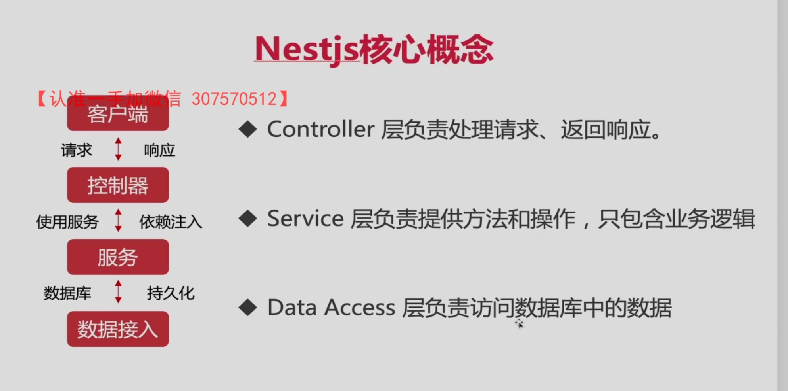
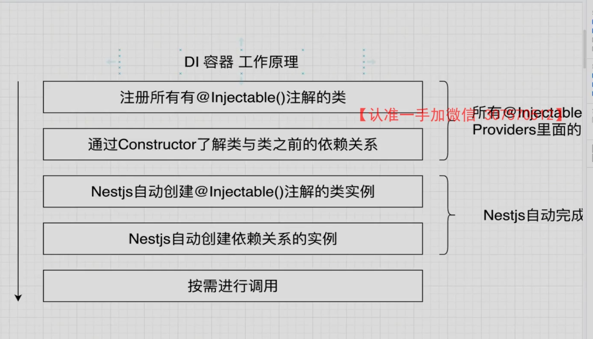
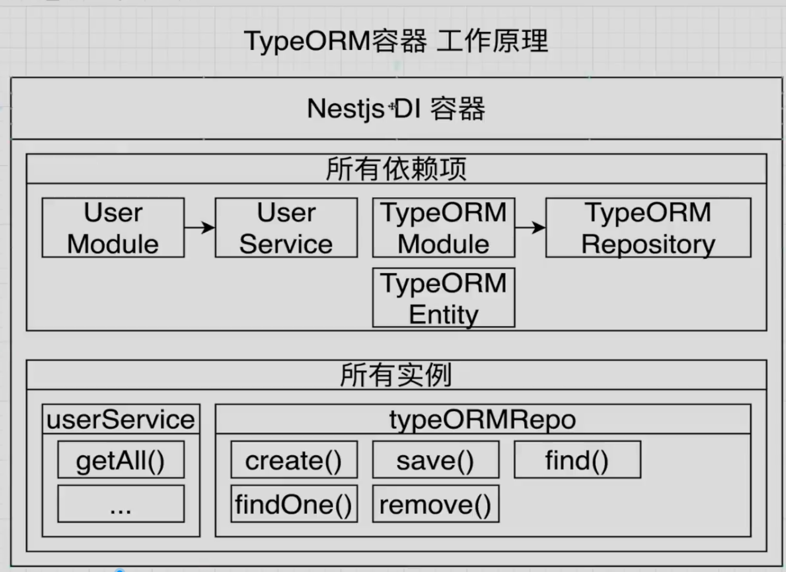
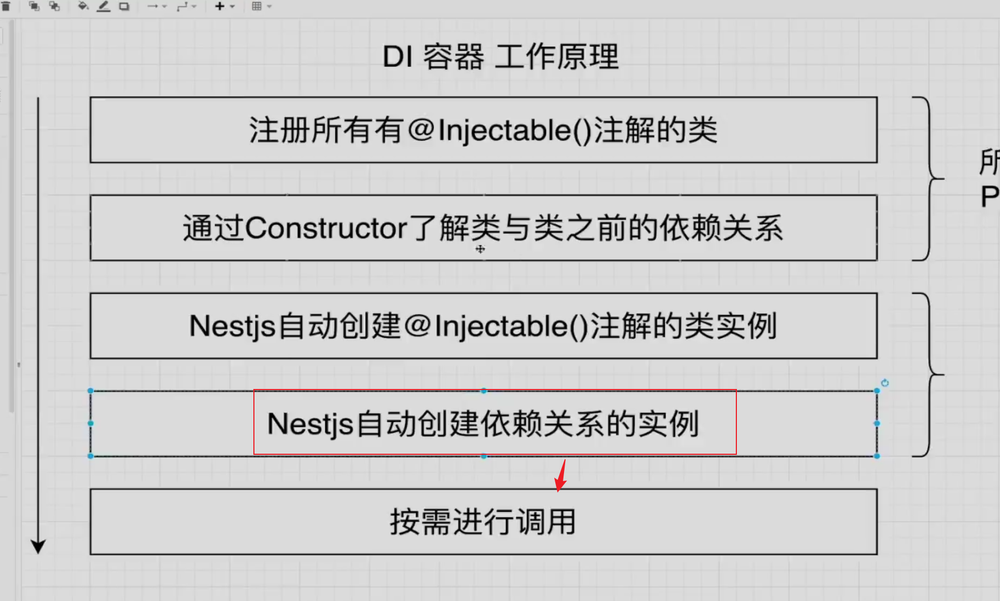
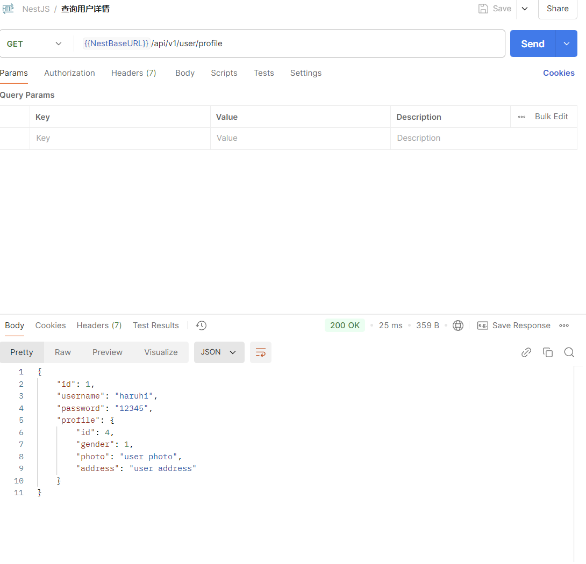
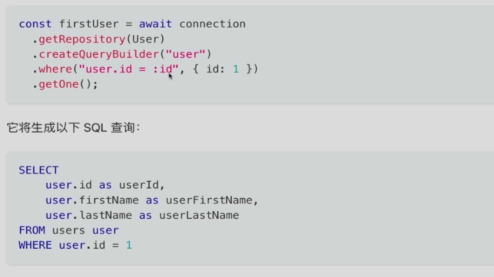
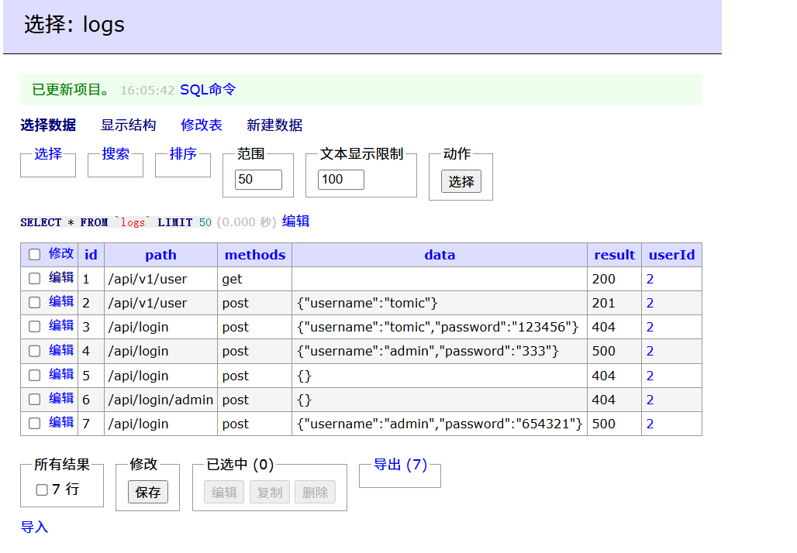

# TypeOrm CRUD



 





## 配置sql参数请求

user.service.ts:
```ts
import { Injectable } from '@nestjs/common';
import { InjectRepository } from '@nestjs/typeorm';
import { User } from './user.entity';
import { Repository } from 'typeorm';
@Injectable()
export class UserService {
  constructor(
    @InjectRepository(User) private readonly userRepository: Repository<User>,
  ) {}
  getUsers() {
    return {
      code: 0,
      data: [],
      msg: '获取成功',
    };
  }
  addUser() {
    return {
      code: 0,
      data: {},
      msg: '添加成功',
    };
  }
}

```

#### **`@InjectRepository(User)` 的作用**

- `@InjectRepository` 是一个装饰器，用于将 TypeORM 提供的 `Repository` 注入到服务中。
- 参数 `User` 指定了要操作的实体。
- 注入的 `userRepository` 是一个 `Repository<User>`，用于执行数据库操作（如查询、保存等）。

注意，只在userService里面配置对应的请求参数是行不通的，你应该在user对应的Module里面import对应的User实例:

**user.modules.ts:**

```ts
import { Module } from '@nestjs/common';
import { UserController } from './user.controller';
import { UserService } from './user.service';
import { TypeOrmModule } from '@nestjs/typeorm';
import { User } from './user.entity';

@Module({
  imports: [TypeOrmModule.forFeature([User])],
  controllers: [UserController],
  providers: [UserService],
})
export class UserModule {}

```

forFeature会产生对应模块的依赖性，通过TypeOrmModule.forFeature实例化对应的模块，NESTJS的DI系统就可以识别对应的模块:



# CRUD方法的应用

## 基本的增删改查

user.service.ts:

```typescript
import { Injectable } from '@nestjs/common';
import { InjectRepository } from '@nestjs/typeorm';
import { User } from './user.entity';
import { Repository } from 'typeorm';
@Injectable()
export class UserService {
  constructor(
    /* @InjectRepository 是一个装饰器，用于将 TypeORM 提供的 Repository 注入到服务中。 */
    @InjectRepository(User) private readonly userRepository: Repository<User>,
  ) {}
  findAll() {
    // 传空参代表查询所有
    return this.userRepository.find();
  }
  find(username: string) {
    return this.userRepository.findOne({ where: { username } });
  }
  async create(user: User) {
    const userTmp = await this.userRepository.create(user);
    return this.userRepository.save(userTmp);
  }
  async update(id: number, user: Partial<User>) {
    return this.userRepository.update(id, user);
  }
  remove(id: number) {
    return this.userRepository.delete(id);
  }
}

```

只需要直接执行本表的delete、update、save、findOne、find 方法，就可以实现基于本表的增删改查。

#### 1. **导入必要的模块和装饰器：**

```typescript
import { Injectable } from '@nestjs/common';
import { InjectRepository } from '@nestjs/typeorm';
import { User } from './user.entity';
import { Repository } from 'typeorm';
```

- **`@Injectable()`**：这个装饰器标记 `UserService` 类为一个可注入的服务类，表示它可以被其他类（例如控制器或其他服务）注入使用。
- **`@InjectRepository(User)`**：`InjectRepository` 装饰器用于将 `User` 实体的 `Repository` 注入到 `UserService` 中。`Repository` 提供了对 `User` 实体的操作方法（如 `find()`, `create()`, `save()`, `update()`, `delete()` 等）。
- **`User`**：这是 `User` 实体类，定义了与 `User` 表相关的数据库字段。
- **`Repository`**：`TypeORM` 中的一个类，提供了数据库操作的各种方法。

#### 2. **服务类定义：**

```typescript
@Injectable()
export class UserService {
  constructor(
    @InjectRepository(User) private readonly userRepository: Repository<User>,
  ) {}
```

- **`UserService`**：这是一个服务类，通常负责处理与 `User` 实体相关的业务逻辑。
- **构造函数**：在构造函数中，`@InjectRepository(User)` 装饰器注入了 `User` 实体的 `Repository`，它使得该服务能够执行所有与 `User` 数据相关的操作。`private readonly userRepository: Repository<User>` 表示该类的私有只读属性 `userRepository`，它可以用于调用 `TypeORM` 的数据库操作方法。

#### 3. **`findAll()` 方法：**

```
typescript复制代码findAll() {
  // 传空参代表查询所有
  return this.userRepository.find();
}
```

- **`findAll`**：这个方法没有任何参数，表示查询所有用户数据。
- **`this.userRepository.find()`**：通过 `find()` 方法，`TypeORM` 会返回所有的 `User` 实体记录。返回的是一个包含多个 `User` 对象的数组。

#### 4. **`find(username: string)` 方法：**

```
typescript复制代码find(username: string) {
  return this.userRepository.findOne({ where: { username } });
}
```

- **`find(username: string)`**：这个方法接收一个 `username` 字符串作为参数，用来查询特定用户名的用户。
- **`this.userRepository.findOne({ where: { username } })`**：`findOne()` 方法用于查询满足条件的单条记录。这里使用 `where: { username }` 来查找用户名为指定值的用户。

#### 5. **`create(user: User)` 方法：**

```typescript
async create(user: User) {
  const userTmp = await this.userRepository.create(user);
  return this.userRepository.save(userTmp);
}

```

- **`create(user: User)`**：此方法用于创建一个新的 `User` 实体。
- **`this.userRepository.create(user)`**：`create()` 方法会创建一个新的 `User` 实体对象，但并不会立即保存到数据库中。它只是生成一个 `User` 实例，准备将数据插入数据库。
- **`this.userRepository.save(userTmp)`**：`save()` 方法将新的 `User` 实体保存到数据库中。它会根据实体的主键判断是插入新的记录还是更新现有记录。

#### 6. **`update(id: number, user: Partial<User>)` 方法：**

```ts
async update(id: number, user: Partial<User>) {
  return this.userRepository.update(id, user);
}
```

**`update(id: number, user: Partial<User>)`**：这个方法用于更新现有的用户数据。

**`this.userRepository.update(id, user)`**：`update()` 方法接收两个参数：

- `id`：需要更新的 `User` 实体的 ID。
- `user`：要更新的数据，`Partial<User>` 表示只需要更新 `User` 实体的部分字段。

该方法会返回一个 `Promise`，包含更新操作的结果。

#### 7. **`remove(id: number)` 方法：**

```typescript
remove(id: number) {
  return this.userRepository.delete(id);
}
```

- **`remove(id: number)`**：此方法用于删除指定 ID 的用户。
- **`this.userRepository.delete(id)`**：`delete()` 方法根据给定的 `id` 删除对应的 `User` 实体记录。

### 通过controller调用具体的方法

我们可以在对应的controller实现具体调用请求的行为和操作方式，在不同的请求方式下面写入对应的操作方法名称，写入具体的参数和具体调用的userRepository行为:

```typescript
import { Controller, Delete, Get, Patch, Post } from '@nestjs/common';
import { UserService } from './user.service';
import { ConfigService } from '@nestjs/config';
import { User } from './user.entity';
@Controller('user')
export class UserController {
  constructor(
    private userService: UserService,
    private configSerivce: ConfigService,
  ) {}
  @Get()
  getUser(): any {
    return this.userService.findAll();
  }

  @Post()
  addUser(): any {
    const user = {
      username: 'haruhi',
      password: '12345',
    } as User;
    return this.userService.create(user);
  }
  @Patch()
  updateUser(): any {
    // todo 传递参数id
    // todo 异常处理
    const user = { username: 'newname' } as User;
    return this.userService.update(1, user);
  }

  @Delete()
  deleteUser(): any {
    // todo 传递参数id
    return this.userService.remove(1);
  }
}

```


### 总结：

这个 `UserService` 类是一个典型的 `NestJS` 服务类，它通过注入 `User` 实体的 `Repository` 来执行与数据库交互的操作。常见的数据库操作方法如 `find`, `findOne`, `create`, `update`, 和 `delete` 被封装在服务方法中，供其他组件（如控制器）调用。

#### **主要要点：**

- **`@Injectable()`**：使得 `UserService` 成为一个可注入的服务类。
- **`@InjectRepository(User)`**：通过 `TypeORM` 的 `InjectRepository` 注入 `User` 实体的 `Repository`。
- **`Repository`**：提供了与数据库交互的方法，例如查找、创建、更新和删除。
- **`findAll`, `find`, `create`, `update`, `remove`**：这些方法封装了常见的数据库操作，使得服务可以轻松地与数据库进行交互。

## 外键查询

如果使用了 `@OneToOne` 装饰器来定义 `User` 和 `Profile` 之间的关系，那么就必须要在两边写上@OneToOne查询。

user.service.ts:

```ts
import { Injectable } from '@nestjs/common';
import { InjectRepository } from '@nestjs/typeorm';
import { User } from './user.entity';
import { Repository } from 'typeorm';
@Injectable()
export class UserService {
  constructor(
    /* @InjectRepository 是一个装饰器，用于将 TypeORM 提供的 Repository 注入到服务中。 */
    @InjectRepository(User) private readonly userRepository: Repository<User>,
  ) {}
  findProfile(id: number) {
    return this.userRepository.findOne({
      where: {
        id,
      },
      relations: {
        profile: true,
      },
    });
  }
}

```

### **为什么两边都要写 `@OneToOne` 装饰器：**

在 `TypeORM` 中，**双向关系**（Bidirectional Relationship）需要在两个实体中都显式声明，才能使得关联关系生效并且能够进行有效的数据库查询。

- **`User` 实体的 `@OneToOne`**： 在 `User` 实体中，您使用了 `@OneToOne(() => Profile)` 来表示一个用户 (`User`) 具有一个对应的个人资料 (`Profile`)。但是，这个装饰器本身并没有指示 **`Profile`** 实体如何与 **`User`** 实体关联。

  **user.entity.ts:**

  ```ts
  import { Logs } from 'src/logs/logs.entity';
  import { Roles } from 'src/roles/roles.entity';
  import {
    Entity,
    PrimaryGeneratedColumn,
    Column,
    OneToMany,
    ManyToMany,
    JoinTable,
    OneToOne,
  } from 'typeorm';
  import { Profile } from './profile.entity';
  
  @Entity()
  export class User {
    @PrimaryGeneratedColumn()
    id: number;
  
      ......
  
    // 必须要补上one to one，才能实现和profile的连接关系
    @OneToOne(() => Profile)
    profile: Profile;
  }
  ```

  **`(profile) => profile.user` 部分是在 `Profile` 实体中定义反向关系的关键：**

  - `(profile)`：这表示你传递了 `Profile` 实体的引用给 `OneToOne` 装饰器，告诉 `TypeORM` 要建立与 `Profile` 实体的关系。

  - `profile.user`：这是反向关系的定义，**指明了 `Profile` 实体中哪个字段是与 `User` 实体相关的。**通常，在 `Profile` 实体中你会有一个 `user` 字段，该字段是与 `User` 相关的。因此，`(profile) => profile.user` 告诉 `TypeORM`，`Profile` 中有一个字段 `user`，它是与 `User` 实体关联的。

    

  **profile.entity.ts:**

- **`Profile` 实体的 `@OneToOne` 和 `@JoinColumn`**： 在 `Profile` 实体中，您定义了 `@OneToOne(() => User)`，表示一个个人资料 (`Profile`) 只与一个用户 (`User`) 相关联。同时，使用了 `@JoinColumn({ name: 'uid' })` 来指定连接列的名称，表明在 `Profile` 表中存储 `User` 实体的外键（`uid`）。

  ```ts
  import {
    Column,
    Entity,
    JoinColumn,
    OneToOne,
    PrimaryGeneratedColumn,
  } from 'typeorm';
  import { User } from './user.entity';
  @Entity()
  export class Profile {
    @PrimaryGeneratedColumn()
    id: number;
      
      ......
  
     @OneToOne(() => Profile, (profile) => profile.user)
    @JoinColumn({ name: 'uid' })
    user: User;
  }
  ```


### **双向关系的必要性：**

1. **在 `User` 中使用 `@OneToOne`**： 这样声明了 `User` 和 `Profile` 之间的单向关系，使得每个 `User` 可以访问其对应的 `Profile`。
2. **在 `Profile` 中使用 `@OneToOne` 和 `@JoinColumn`**： 在 `Profile` 中声明了 `@OneToOne(() => User)`，明确了 `Profile` 与 `User` 的关系，并且使用 `@JoinColumn` 指定了外键列（`uid`）。这样，`Profile` 表会包含指向 `User` 表的外键列。

### **为什么必须在两边都写 `@OneToOne`？**

- **明确外键的存储位置**：`@OneToOne` 和 `@JoinColumn` 确定了外键列的存储位置，`Profile` 实体通过 `@JoinColumn` 明确了外键列（`uid`）的位置，告知数据库在 `Profile` 表中存储 `User` 实体的外键。
- **双向关系访问**：如果仅在 `User` 或 `Profile` 其中一方声明关系，那么另一方将无法自动访问对方的数据。因此，您必须在双方都声明 `@OneToOne`，以便能够通过 `relations` 选项进行关联查询，并通过两方实体访问对方数据。

### **`findProfile` 方法的工作原理：**

在您的 `findProfile` 方法中，您使用了 `findOne` 来查找一个 `User` 实体，并通过 `relations` 选项指定需要加载与之相关联的 `Profile` 实体：

```typescript
findProfile(id: number) {
  return this.userRepository.findOne({
    where: {
      id,
    },
    relations: {
      profile: true,  // 这里通过relations选项加载User与Profile之间的关系
    },
  });
}

```

- `findOne()`：查找一个 `User` 实体。
- `relations: { profile: true }`：加载与 `User` 实体相关联的 `Profile` 实体。

由于在 `User` 和 `Profile` 实体中都声明了 `@OneToOne` 关系，TypeORM 知道应该加载 `User` 和 `Profile` 之间的关联，并自动从 `Profile` 表中通过外键列（`uid`）连接 `User` 表。

### controller控制器

在user.controller.ts中写入:
```TS
  @Get('/profile')
  getUserProfile(): any {
    return this.userService.findProfile(1);
  }
```



### **总结**：

- **双向声明关系**：`@OneToOne` 在两个实体中都要声明，以便明确和正确处理外键约束和关联查询。
- **`@JoinColumn`**：指定外键的存储位置，它只能在一方实体（通常是“被拥有方”）上使用，指明外键列的名称。
- **`relations` 选项**：在 `findOne` 或其他查询方法中通过 `relations` 来加载相关联的实体数据。


## QueryBuilder

QueryBuider是TypeORM最强大的功能之一，它允许你使用优雅便捷的语法构建SQL查询，执行并获取自动转化的实体。



### 联合查询案例

首先我们先创建几条不同返回状态的数据:


#### user.service.ts

```ts
findLogsByGroup(id: number) {
  // SELECT Logs.result, COUNT(logs.result) FROM logs,
  // user WHERE user.id = logs.userId AND user.id = 2 GROUP BY logs.result;

  return (
    this.logRepository
      .createQueryBuilder('logs') // 使用 createQueryBuilder 来构建查询，'logs' 是查询的别名
      .select('logs.result', 'result') // 选择 logs.result 作为查询结果，并将它别名为 'result'
      .addSelect('COUNT("logs.result")', 'count') // 统计每个 result 的出现次数，并别名为 'count'
      .leftJoinAndSelect('logs.user', 'user') // 左连接 logs 和 user 表，并将 user 表命名为 'user'
      .where('user.id=:id', { id }) // 条件过滤：只查询 user.id 等于传入的 id 的记录
      .groupBy('logs.result') // 根据 logs.result 进行分组
      .orderBy('count', 'DESC') // 按照 count 的数量进行降序排序
      .addOrderBy('result', 'DESC') // 如果 count 相同，则按 result 进行降序排序
      .limit(3) // 限制返回的记录数为最多 3 条
      .getRawMany() // 执行查询并返回原始数据（即不映射为实体，而是直接返回查询结果）
  );
}

```

`findLogsByGroup` 是你在 `UserService` 中定义的一个方法，用于查询 `Logs` 表中与特定 `User` 相关的日志，并根据日志结果的数量进行分组。下面是这个方法的详细讲解：

1. **`createQueryBuilder('logs')`**:
   - `createQueryBuilder` 是 `TypeORM` 提供的方法，允许你使用更复杂的查询（例如 `JOIN`、`GROUP BY`、`HAVING` 等）。这里的 `'logs'` 是为 `logs` 表指定的别名，后续的查询都将基于这个别名。
2. **`select('logs.result', 'result')`**:
   - 选择 `logs` 表中的 `result` 字段，并为其指定别名 `'result'`。这就是查询结果中的一个字段，表示日志的结果（例如，可能是成功、失败、错误等）。
3. **`addSelect('COUNT("logs.result")', 'count')`**:
   - `addSelect` 用于添加一个额外的字段，`COUNT("logs.result")` 是 SQL 中的聚合函数，统计每个 `result` 字段的出现次数。`count` 是该字段的别名，用于返回每种 `result` 出现的次数。
4. **`leftJoinAndSelect('logs.user', 'user')`**:
   - 通过 `leftJoinAndSelect` 执行左连接，将 `logs` 表和 `user` 表连接起来。`logs.user` 是 `logs` 表中的 `user` 字段（假设在 `logs` 表中有一个外键指向 `user` 表），`'user'` 是连接后的 `user` 表的别名。这样你就能访问与日志相关的用户信息。
5. **`where('user.id=:id', { id })`**:
   - `where` 条件限制查询，指定只查询 `user.id` 等于传入参数 `id` 的记录。`{ id }` 是通过占位符传递给查询的实际值。
6. **`groupBy('logs.result')`**:
   - `groupBy` 是 SQL 中的 `GROUP BY` 子句，表示将结果按 `logs.result` 字段进行分组。每种 `result` 的日志将会被分为一组，这样你就能统计每种 `result` 的出现次数。
7. **`orderBy('count', 'DESC')`**:
   - `orderBy` 对查询结果进行排序，这里表示按照 `count` 字段（即每种 `result` 出现的次数）进行降序排序。
8. **`addOrderBy('result', 'DESC')`**:
   - 如果 `count` 相同，使用 `addOrderBy` 继续对 `result` 字段进行降序排序。这是为了保证在 `count` 相同的情况下，`result` 字段也会按照值的大小排序。
9. **`limit(3)`**:
   - `limit` 限制查询的返回条数，这里设置为最多返回 3 条记录，意味着你只会得到出现次数最多的前 3 种 `result`。
10. **`getRawMany()`**:

- `getRawMany` 执行查询并返回原始数据，而不是映射为实体。返回的数据将是一个数组，每个元素是一个包含 `result` 和 `count` 的对象，代表每个 `result` 的出现次数。

#### user.controller.ts

```ts
  @Get('/logsByGroup')
  async getLogsByGroup(): Promise<any> {
    const res = await this.userService.findLogsByGroup(2);
    return res.map((o) => ({
      result: o.result,
      count: o.count,
    }));
  }
}
```

### 1. 异步函数 (`async`)

方法前面使用了 `async` 关键字，表示这是一个异步函数。异步函数总是返回一个 `Promise` 对象，即使你没有显式地使用 `return` 返回一个 `Promise`。

例如：

```typescript
async function example() {
  return 42;
}
```

即使你没有手动创建 `Promise`，上面的代码等价于：

```typescript
async function example() {
  return Promise.resolve(42);
}
```

所以，无论你在 `async` 函数中返回什么类型的值，它都会被包装在一个 `Promise` 中。

### 2. 使用 `await` 关键字

在 `getLogsByGroup` 方法中，使用了 `await` 关键字来等待 `this.userService.findLogsByGroup(2)` 方法的执行结果：

```typescript
const res = await this.userService.findLogsByGroup(2);
```

`await` 关键字会暂停函数的执行，直到 `this.userService.findLogsByGroup(2)` 返回一个 `Promise` 并解决（resolve）。在解决之后，`res` 将保存 `Promise` 解决的结果，即 `findLogsByGroup` 返回的查询结果。

假设 `findLogsByGroup` 返回一个 `Promise`，并最终解决为一个数组（例如日志结果），那么 `res` 会是这个数组。

### 3. 返回值的类型

`res.map(...)` 会返回一个新的数组，其中每个元素是对原始数据的映射。由于 `map` 返回的是一个新的数组，`getLogsByGroup` 方法的返回值本身是一个 `Promise`，包装了最终的结果。

由于 `findLogsByGroup` 的返回值类型是动态的（例如，可能是一个对象数组），因此 `getLogsByGroup` 的返回值是一个 `Promise<any>`，也就是：

- `Promise` 表示它是一个异步操作；
- `any` 表示返回的内容类型不明确，可以是任何类型，这取决于 `findLogsByGroup` 查询结果的结构。

为了更好地类型化，我们可以更精确地定义返回值类型，而不是使用 `any`。具体来说，`findLogsByGroup` 返回的是一个包含 `result` 和 `count` 的对象数组。你可以定义一个类型来改进这一点。

### 改进类型定义

你可以为 `getLogsByGroup` 的返回类型提供更具体的类型定义，例如：

```typescript
interface LogGroupResult {
  result: string;
  count: number;
}

@Get('/logsByGroup')
async getLogsByGroup(): Promise<LogGroupResult[]> {
  const res = await this.userService.findLogsByGroup(2);
  return res.map((o) => ({
    result: o.result,
    count: o.count,
  }));
}
```

在这个例子中：

- `LogGroupResult` 是一个接口，表示每个日志结果的格式。
- `getLogsByGroup` 的返回类型被显式地指定为 `Promise<LogGroupResult[]>`，表示它返回一个包含多个 `LogGroupResult` 对象的数组的 `Promise`。

这样就不需要使用 `any`，并且能够更准确地描述返回的数据结构，提高了类型安全性和代码的可维护性。

### 总结

- `Promise<any>` 是因为 `getLogsByGroup` 是异步函数，它返回的是一个 `Promise`。
- `any` 是一个通用的类型，表示返回值的类型不明确。为了提高代码的类型安全性和可维护性，你可以定义一个具体的接口来代替 `any`，使返回值类型更加明确。
