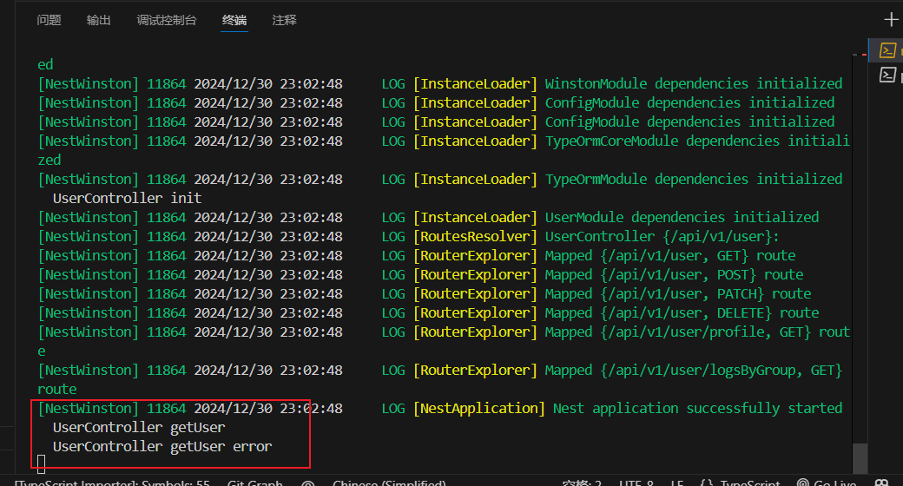
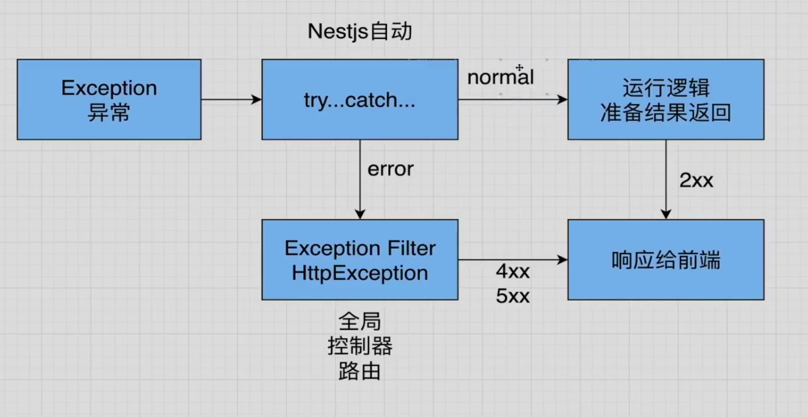
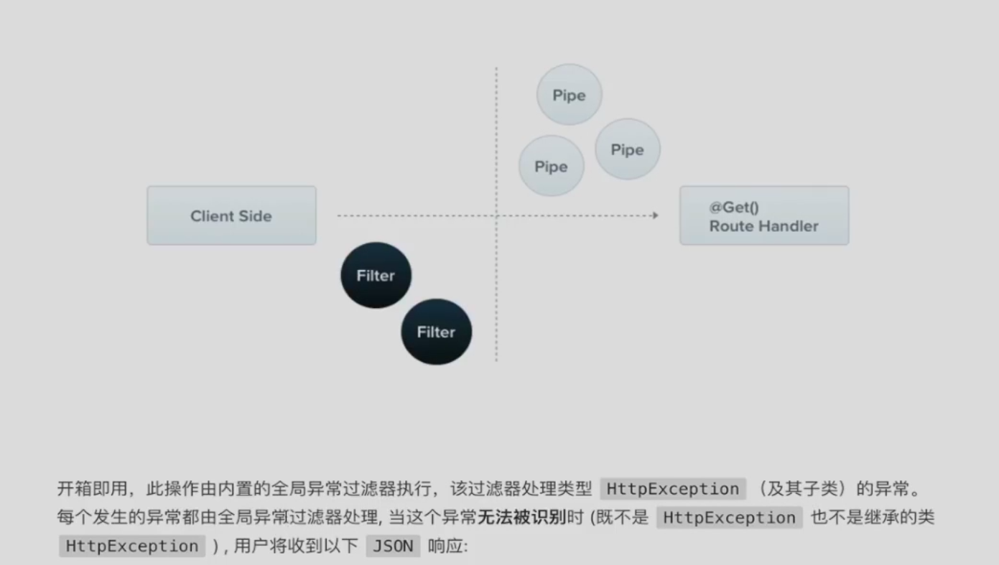
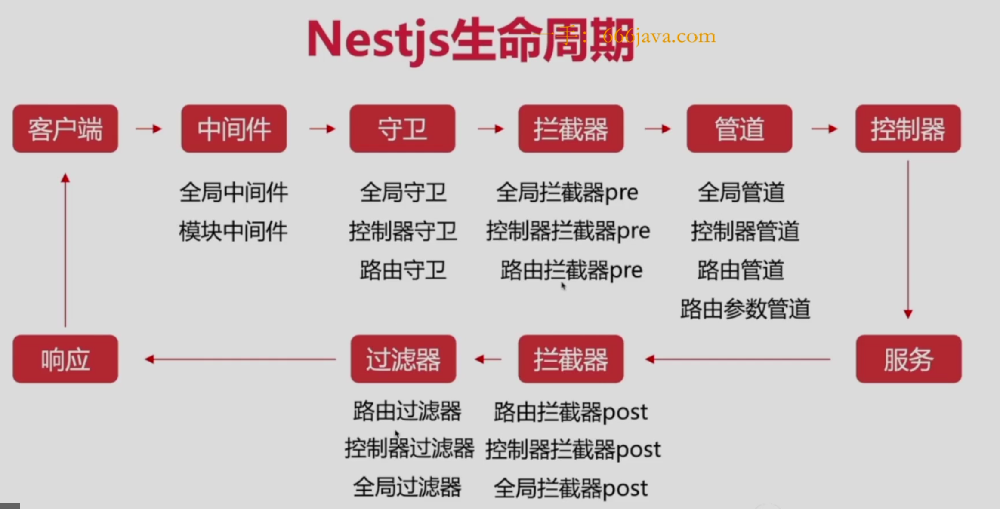
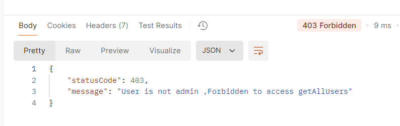
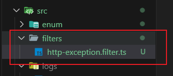
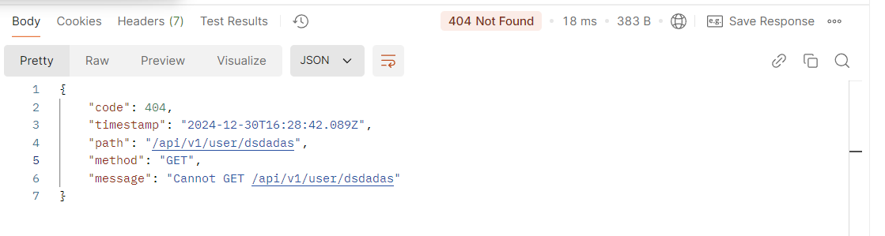
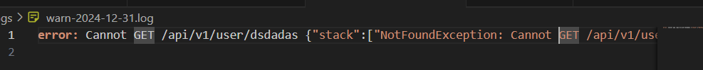

# winston

## winston的基本使用

我的思路是:

在main.ts中配置对应的logger:

```ts
import { NestFactory } from '@nestjs/core';
import { AppModule } from './app.module';
import * as winston from 'winston'; // 修改导入方式
import { utilities, WinstonModule } from 'nest-winston';

async function bootstrap() {
  const instance = winston.createLogger({
    transports: [
      // 这代表了一个控制台输出
      new winston.transports.Console({
        // 这里是控制台输出的格式
        format: winston.format.combine(
          // 这里是一个时间戳
          winston.format.timestamp(),
          // 这里是一个颜色化的输出
          utilities.format.nestLike(),
        ),
      }),
    ],
  });
  const app = await NestFactory.create(AppModule, {
    // 利用winston模块创建一个logger，这个logger会把实例传递给NestFactory
    logger: WinstonModule.createLogger({
      instance,
    }),
  });
  app.setGlobalPrefix('api/v1'); // 全局前缀
  const port = 3000;
  await app.listen(port);
}
bootstrap();

```

在app.module.ts中先定义一个winston的实例，用于创建具体的输出配置:

```TS
import { Global, Logger, Module } from '@nestjs/common';
import * as winston from 'winston'; // 修改导入方式
import { utilities, WinstonModule } from 'nest-winston';

// Global是一个装饰器，用于将模块标记为全局作用域
// 你可以理解为把app.module.ts里面的providers和controllers提取出来，进行全局注册
@Global()
@Module({
  imports: [
      ......
    WinstonModule.forRoot({
      transports: [
        new winston.transports.Console({
          format: winston.format.combine(
            winston.format.timestamp(),
            winston.format.colorize(),
            utilities.format.nestLike(),
          ),
        }),
      ],
    }),
    UserModule,

  ......
  ],
  controllers: [],
  providers: [Logger],
})
export class AppModule {}

```

这里的精华在于`@Global()`全局声明，这可以使得我们在全局得以应用providers。

紧接着我们就可以无需另外导入，直接在user.controller.ts中使用,无需使用@Inject进行声明形式的导入，直接利用app.module.ts中定义的`@Global()`的特性跨模块使用:
```ts
import {
  Controller,
  Delete,
  Get,
  Inject,
  Patch,
  Post,
} from '@nestjs/common';
......
......
import { Logger } from 'winston'; // 修改导入
import { WINSTON_MODULE_PROVIDER } from 'nest-winston'; 

@Controller('user')
export class UserController {
  // private logger = new Logger(UserController.name);
  constructor(
    private userService: UserService,
    private configSerivce: ConfigService,
    @Inject(WINSTON_MODULE_PROVIDER) private readonly logger: Logger,
  ) {
    this.logger.info('UserController init');
  }
    ......
    
  @Get()
  getUser(): any {
    this.logger.info('UserController getUser');
    this.logger.error('UserController getUser error');
    return this.userService.findAll();
  }
......
}

```

最后启动服务器看一下结果:



## Winston的滚动日志

首先我们需要安装依赖的插件:
`pnpm install winston-daily-rotate-file`

然后在main.ts中定义滚动日志文件的配置:

```ts
import { NestFactory } from '@nestjs/core';
import { AppModule } from './app.module';
import * as winston from 'winston'; // 修改导入方式
import { utilities, WinstonModule } from 'nest-winston';
import 'winston-daily-rotate-file'; // 导入滚动日志文件
async function bootstrap() {
  const instance = winston.createLogger({
    level: 'info', // 设置默认日志级别
    transports: [
      new winston.transports.Console({
        level: 'info',
        format: winston.format.combine(
          winston.format.timestamp(),
          utilities.format.nestLike(),
        ),
      }),
      // INFO 级别日志文件
      new winston.transports.DailyRotateFile({
        level: 'info',
        dirname: 'logs',
        filename: 'info-%DATE%.log',
        datePattern: 'YYYY-MM-DD',
        zippedArchive: true,
        maxSize: '20m',
        maxFiles: '14d',
        format: winston.format.combine(
          winston.format.timestamp(),
          winston.format.json(),
        ),
      }),
      // WARN 和 ERROR 级别日志文件
      new winston.transports.DailyRotateFile({
        level: 'warn',
        dirname: 'logs',
        filename: 'warn-%DATE%.log',
        datePattern: 'YYYY-MM-DD',
        zippedArchive: true,
        maxSize: '20m',
        maxFiles: '14d',
        format: winston.format.combine(
          winston.format.timestamp(),
          winston.format.simple(),
        ),
      }),
    ],
  });

  // 添加错误处理
  instance.on('error', (error) => {
    console.error('Winston error:', error);
  });

  const app = await NestFactory.create(AppModule, {
    logger: WinstonModule.createLogger({
      instance,
    }),
  });

  app.setGlobalPrefix('api/v1');
  const port = 3000;
  await app.listen(port);
}
bootstrap();

```

## 全局异常过滤器



内置的异常层负责处理整个应用程序中所有抛出的异常。

当捕获到合理的异常时，最终用户将收到友好的响应。




过滤器在整个生命周期的末尾。

NestJS提供了一个内置的HttpException类，它从`@nestjs/common`包中导入。

对于经典的由于`HTTP REST/GraphQl` API程序,最佳实践是在发生某些错误情况时，发送标准HTTP响应对象。

我们在user.controller.ts中写入对应的处理方法:

```typescript
  @Get()
  getUser(): any {
    const user = { isAdmin: false };
    if (!user.isAdmin) {
      throw new HttpException('User is not admin ,Forbidden to access getAllUsers', HttpStatus.FORBIDDEN);
    }
    this.logger.info('Info: API call to getUser');
    this.logger.warn('Warning: This is a test warning');
    this.logger.error('Error: This is a test error');

    return this.userService.findAll();
  }
```

请求的返回结果:


HttpStatus内置了各种状态码，为我们准备好了各种返回状态。  


### 捕获全局HttpException

首先先创建一个对应的文件:


先创建一个继承于ExceptionFilter的类:

**http-exception.filter.ts**

```typescript
import { Catch, ExceptionFilter, HttpException } from '@nestjs/common';
// 首先定义一个异常过滤器类，然后使用 @Catch() 装饰器来指定需要捕获的异常类型
@Catch(HttpException)
export class HttpExceptionFilter implements ExceptionFilter {
  // 在这里主要展示的是Catch的实现，接下来我们来看看如何使用这个过滤器
}

```

接下来来实现Catch方法:

```typescript
import {
  ArgumentsHost,
  Catch,
  ExceptionFilter,
  HttpException,
} from '@nestjs/common';
// 首先定义一个异常过滤器类，然后使用 @Catch() 装饰器来指定需要捕获的异常类型
@Catch(HttpException)
export class HttpExceptionFilter implements ExceptionFilter {
  // 在这里主要展示的是Catch的实现，接下来我们来看看如何使用这个过滤器
  catch(exception: HttpException, host: ArgumentsHost) {
    console.log(
      'file:exception.filter.ts line:5 class:HttpExceptionFilter catch exception',
      exception,
    );
    const ctx = host.switchToHttp();
    // 获取响应和请求对象
    const response = ctx.getResponse();
    const request = ctx.getRequest();
    // 获取异常的状态码
    const status = exception.getStatus();
    // 获取异常的响应体
    response.status(status).json({
      code: status,
      timestamp: new Date().toISOString(),
      path: request.url,
      method: request.method,
      message: exception.message || HttpException.name,
    });
    throw new Error('Method not implemented.');
  }
}

```

接下来我们在main.ts中应用该全局异常响应器:
```typescript
import { NestFactory } from '@nestjs/core';
......
import { HttpExceptionFilter } from './filters/http-exception.filter';
async function bootstrap() {
  const instance = winston.createLogger({
 		......
      	......
  app.useGlobalFilters(new HttpExceptionFilter());

}
bootstrap();

```

**请注意，全局的Filter只能有一个，且仅有一个生效，这里已经定义了`app.useGlobalFilters`**

响应结果就是我们定义的获取异常的响应体:


当然我们也可以在这里定义一个log日志:
```TS
import {
  ArgumentsHost,
  Catch,
  ExceptionFilter,
  HttpException,
} from '@nestjs/common';
import { Logger } from 'winston';
// 首先定义一个异常过滤器类，然后使用 @Catch() 装饰器来指定需要捕获的异常类型
@Catch(HttpException)
export class HttpExceptionFilter implements ExceptionFilter {
  constructor(private logger: Logger) {}
  // 在这里主要展示的是Catch的实现，接下来我们来看看如何使用这个过滤器
  catch(exception: HttpException, host: ArgumentsHost) {
......
......
    this.logger.error(exception.message, exception.stack);
    // 获取异常的响应体
    response.status(status).json({
      code: status,
      timestamp: new Date().toISOString(),
      path: request.url,
      method: request.method,
      message: exception.message || exception.name,
    });
    throw new Error('Method not implemented.');
  }
}

```

日志文件出现记录:

