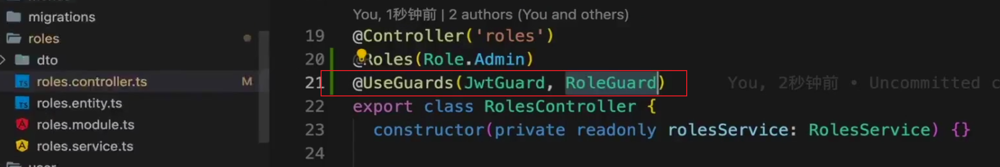

# 实现角色访问控制(RBAC)

我们需要自定义一个装饰器 `@Roles()`来实现基于角色的RBAC:

**roles.decorator.ts**

```typescript
import { SetMetadata } from '@nestjs/common';
import { Role } from 'src/enum/roles.enum';
// 1. 定义元数据的key
export const ROLES_KEY = 'roles';
// 2. 创建装饰器
export const Roles = (...roles: Role[]) => SetMetadata(ROLES_KEY, roles);

```

具体作用：

装饰器定义：

```typescript
   // 可以接收多个角色参数
   @Roles(Role.Admin, Role.User)
```

实际使用场景：

```typescript
@Controller('menus')
@Roles(Role.Admin)  // 表示只有管理员可以访问这个控制器
export class MenusController {
    @Get()
    @Roles(Role.User)  // 可以在具体方法上设置不同的角色要求
    findAll() {
        return this.menusService.findAll();
    }
}
```

1. 工作原理：

- SetMetadata 将角色信息附加到路由或控制器上

- 在 Guard 中可以读取这些元数据来进行权限验证
- 例如我们通过 `nest g gu guards/role -d`来创建role.guards.ts。


## roleGuard解析



我们需要在roles.controller.ts中去设计守卫信息，所以我们需要注入RoleGuard，而roleGuard依赖JwtGuard生成的user信息，比如`req.user`。

`@useGuards()`里面的参数是顺序执行，RoleGuard可以获取jwtGuard执行后的产物，也就是user之类的信息。

```typescript
import { CanActivate, ExecutionContext, Injectable } from '@nestjs/common';
import { Reflector } from '@nestjs/core';
import { Role } from 'src/enum/roles.enum';
import { ROLES_KEY } from 'src/decorators/roles.decorator';
import { UserService } from 'src/user/user.service';

@Injectable()
export class RoleGuard implements CanActivate {
  constructor(private reflector: Reflector, private userService: UserService) {}

  async canActivate(context: ExecutionContext): Promise<boolean> {
    // jwt -> userId -> user -> roles
    // getAllAndMerge -> 合并 getAllAndOveride -> 读取路由上的metadata
    const requiredRoles = this.reflector.getAllAndMerge<Role[]>(ROLES_KEY, [
      context.getHandler(),
      context.getClass(),
    ]);
    if (!requiredRoles) {
      return true;
    }
    const req = context.switchToHttp().getRequest();
    // user -> roles -> menu -> CURD + M, C1,C2,C3
    const user = await this.userService.find(req.user.username);

    const roleIds = user.roles.map((o) => o.id);

    const flag = requiredRoles.some((role) => roleIds.includes(role));

    // 添加调试日志
    console.log('Required roles:', requiredRoles);
    console.log('User from request:', req.user);
    console.log('User roles:', user?.roles);

    return flag;
  }
}

```


这段代码是在从路由处理函数和控制器类中获取角色权限信息,我们需要重点讲解以下代码:

```typescript
const requiredRoles = this.reflector.getAllAndMerge<Role[]>(ROLES_KEY, [
  context.getHandler(),
  context.getClass(),
]);
```

### 具体含义：

1. `this.reflector`: NestJS提供的反射工具，用于读取装饰器中的元数据

2. `getAllAndMerge<Role[]>`: 从多个地方获取元数据并合并成一个数

   不同于`getAllAndOverride`(会用后面的覆盖前面的)，这个方法会将所有找到的角色都合并起来

3. `ROLES_KEY`: 就是元数据的键名，对应`@Roles()`装饰器中使用的键

4. `[context.getHandler(), context.getClass()]`: 指定要从哪两个地方查找元数据

- `context.getHandler()`: 当前请求的路由处理方法

- `context.getClass()`: 当前控制器类

### 实际例子

```typescript
@Controller('users')
@Roles(Role.Admin)
class UserController {
  @Get()
  @Roles(Role.User)
  findAll() { ... }
}
```

当用户访问GET /users时：

- context.getClass()找到控制器上的`[Role.Admin]`

- context.getHandler()找到方法上的`[Role.User]`

- getAllAndMerge将它们合并为`[Role.Admin, Role.User]`

这样设计的好处是：

1. 可以在控制器级别设置基本权限要求
2. 可以在方法级别添加或修改权限要求
3. Guard会检查用户是否满足所有必要的角色要求

这是一种灵活且强大的权限控制方式，让你可以在不同层级上定义权限规则。

## 鉴权的流程

```typescript
   if (!requiredRoles) {
      return true;
    }
    const req = context.switchToHttp().getRequest();
    // user -> roles -> menu -> CURD + M, C1,C2,C3
    const user = await this.userService.find(req.user.username);

    const roleIds = user.roles.map((o) => o.id);

    const flag = requiredRoles.some((role) => roleIds.includes(role));
```

1. 权限检查跳过条件：

   如果路由没有通过 @Roles() 设置权限要求，则允许所有人访问

2. 获取用户信息：

   从 JWT 验证后的请求中获取用户名

   通过用户名查询完整的用户信息，包括关联的角色

3. 角色ID提取：

   user.roles.map((o) => o.id) 提取用户拥有的所有角色ID

   例如：用户拥有"管理员"(ID=2)和"编辑者"(ID=3)，则 roleIds = [2, 3]

4. 权限验证：

   .some() 方法检查是否至少有一个元素满足条件

   例如：如果路由要求 @Roles(Role.Admin) 且 Role.Admin = 2

   如果用户角色包含ID=2，则 flag = true，允许访问

   否则 flag = false，拒绝访问

### 权限验证流程示例：

场景：访问需要管理员权限的路由

- 路由上有 @Roles(Role.Admin)，其中 Role.Admin = 2

用户A - 管理员：

- 角色: [{id: 2, name: '管理员'}]

- roleIds = [2]

- requiredRoles = [2]

- roleIds.includes(2) 为 true

- 允许访问

用户B - 普通用户：

- 角色: [{id: 1, name: '普通用户'}]

- roleIds = [1]

- requiredRoles = [2]

- roleIds.includes(2) 为 false

- 拒绝访问，返回403

这种实现方式是一种"宽松匹配"策略 - 只要用户拥有任一所需角色，就允许访问。如果需要更严格的控制，可以改用 .every() 而不是 .some()，要求用户拥有所有所需角色。


# CASL

CASL (Capability Attribute-based Security Language) 是为了解决更细粒度的权限控制问题。让我解释为什么需要 CASL：

传统 RBAC 的局限性

```typescript
// 基于角色的简单权限控制
@Roles(Role.Admin)
async deleteUser() {
  // 只要是管理员就能删除任何用户
}
```

这种方式太过简单，无法处理复杂场景，比如：

- 管理员只能删除自己创建的用户

- 编辑者只能修改自己的文章

- 用户只能查看自己的订单


CASL 的解决方案：

```typescript
// 定义权限规则
export class CaslAbilityFactory {
  createForUser(user: User) {
    const { can, cannot, build } = new AbilityBuilder(Ability);

    if (user.isAdmin) {
      // 管理员可以管理所有内容
      can('manage', 'all');
      // 但不能删除自己的账号
      cannot('delete', 'User', { id: user.id });
    } else {
      // 普通用户只能读取公开内容
      can('read', 'Article', { isPublished: true });
      // 可以管理自己创建的文章
      can('manage', 'Article', { authorId: user.id });
      // 只能查看自己的订单
      can('read', 'Order', { userId: user.id });
    }

    return build();
  }
}
```

实际应用场景：

```typescript
@Injectable()
export class ArticleService {
  constructor(private caslAbilityFactory: CaslAbilityFactory) {}

  async updateArticle(userId: number, articleId: number, data: any) {
    const article = await this.findOne(articleId);
    const ability = this.caslAbilityFactory.createForUser(user);

    // 检查用户是否有权限更新这篇文章
    if (ability.can('update', article)) {
      return this.articleRepository.update(articleId, data);
    } else {
      throw new ForbiddenException('您没有权限更新这篇文章');
    }
  }
}
```

CASL 的优势：

- 细粒度控制：可以基于数据属性进行权限控制

- 灵活的规则定义：支持复杂的条件判断

- 可组合的权限：能够组合多个权限规则

- 统一的权限管理：集中管理所有权限逻辑

常见使用模式：

```typescript
// 定义权限
can('read', 'Article');           // 可以读取所有文章
can('update', 'Article', { authorId: user.id }); // 只能更新自己的文章
cannot('delete', 'User', { role: 'admin' }); // 不能删除管理员

// 检查权限
if (ability.can('update', article)) {
  // 允许更新
}
```

与 NestJS 集成:

```typescript
@Injectable()
export class CaslGuard implements CanActivate {
  constructor(private caslAbilityFactory: CaslAbilityFactory) {}

  async canActivate(context: ExecutionContext): Promise<boolean> {
    const { user, params } = context.switchToHttp().getRequest();
    const ability = this.caslAbilityFactory.createForUser(user);
    
    // 检查特定操作的权限
    return ability.can('update', 'Article', { id: params.id });
  }
}
```

- CASL 解决了需要细粒度权限控制的场景

- 它比简单的 RBAC 更灵活和强大

- 适合复杂的业务逻辑和权限需求

- 能够基于数据属性进行权限判断

- 提供了统一和可维护的权限管理方式

这就是为什么在复杂应用中，我们常常需要 CASL 来补充基本的角色权限控制。

##  NestJS CASL权限控制系统

我们来进一步讲解一下前面的流程，先从casl-ability.service.ts开始:

```typescript
import { Injectable } from '@nestjs/common';
import {
  AbilityBuilder,
  createMongoAbility,
  ExtractSubjectType,
  Subject,
} from '@casl/ability';
import { UserService } from '../user/user.service';
import { getEntities } from '../utils/common';
import { Menus } from '../menus/menu.entity';

@Injectable()
export class CaslAbilityService {
  constructor(private userService: UserService) {}

  async forRoot(username: string) {
    // 针对于整个系统的 -> createUser XX SYStem
    const { can, build } = new AbilityBuilder(createMongoAbility);

    // can('manage', 'all');
    // menu 名称、路径、acl ->actions -> 名称、路径->实体对应
    // path -> prefix -> 写死在项目代码里

    // 其他思路：acl -> 表来进行存储 -> LogController + Action
    // log -> sys:log -> sys:log:read, sys:log:write ...
    const user = await this.userService.find(username);
    // user -> 1:n roles -> 1:n menus -> 去重 {}
    const obj = {} as Record<string, unknown>;
    user.roles.forEach((o) => {
      o.menus.forEach((menu) => {
        // path -> acl -> actions
        // 通过Id去重
        obj[menu.id] = menu;
      });
    });
    const menus = Object.values(obj) as Menus[];
    menus.forEach((menu) => {
      const actions = menu.acl;
      for (let i = 0; i < actions.length; i++) {
        const action = actions[i];
        can(action, getEntities(menu.path));
      }
    });
    // can('read', Logs);
    // cannot('update', Logs);
    // can('manage', 'all');

    const ability = build({
      // 修复类型定义
      detectSubjectType: (item: Subject) =>
        item.constructor as ExtractSubjectType<Subject>,
    });

    // ability.can
    // @CheckPolicies((ability) => ability.cannot(Action, User, ['']))

    return ability;
  }
}

```

这段代码实现了一个基于CASL库的权限控制系统，主要用于管理用户对不同资源的访问权限。我来详细解释一下：

### 整体架构

这是一个典型的基于角色的访问控制(RBAC)系统，扩展为:

- 用户(User) → 拥有多个角色(Roles)

- 角色(Roles) → 关联多个菜单(Menus)

- 菜单(Menus) → 定义访问控制列表(ACL)和路径(path)

### 核心组件

#### CaslAbilityService

这是一个NestJS服务，负责构建用户的权限对象：

```typescript
@Injectable()
export class CaslAbilityService {
  constructor(private userService: UserService) {}
  
  async forRoot(username: string) {
    // ...权限构建逻辑
  }
}
```

### forRoot方法

该方法是核心，根据用户名构建权限对象：

1. 创建CASL能力构建器
2. 查询用户信息
3. 提取用户所有角色的菜单并去重
4. 根据菜单ACL设置权限
5. 返回构建好的权限对象

## 权限构建流程详解

### 初始化能力构建器：

```typescript
   const { can, build } = new AbilityBuilder(createMongoAbility);
```

1. 创建权限构建器：实例化一个 AbilityBuilder 对象，这是 CASL 库提供的权限构建工具

2. 指定能力类型：传入 createMongoAbility 工厂函数，表示创建一个适用于 MongoDB 风格数据的权限对象

3. 解构关键方法：从构建器中提取两个核心功能：

   can: 用于定义"允许"的操作

   build: 用于最终构建权限对象

### 获取用户信息：

```typescript
   const user = await this.userService.find(username);
```

### 提取并去重菜单：

```typescript
   const obj = {} as Record<string, unknown>;
   user.roles.forEach((o) => {
     o.menus.forEach((menu) => {
       obj[menu.id] = menu; // 通过ID去重
     });
   });
   const menus = Object.values(obj) as Menus[];
```

这段代码的核心目的是去重——确保每个菜单项只被处理一次，即使它出现在用户的多个角色中。

#### 为什么需要去重？

在RBAC(基于角色的访问控制)系统中：

一个用户可以拥有多个角色

不同角色可能包含相同的菜单项

如果不去重，相同的菜单会被处理多次，导致：

- 权限重复定义

- 性能浪费

- 可能的逻辑错误

#### 这不是简单的"反复赋值"

表面上看确实是反复赋值，但这正是去重的机制：

- 假设用户有两个角色 A 和 B

- 角色 A 包含菜单 M1(id=1) 和 M2(id=2)

- 角色 B 包含菜单 M2(id=2) 和 M3(id=3)

执行过程：

1. obj[1] = M1（角色A的菜单M1）

1. obj[2] = M2（角色A的菜单M2）

1. obj[2] = M2（角色B的菜单M2，覆盖了上一步的相同菜单）

1. obj[3] = M3（角色B的菜单M3）

最终结果：obj 包含三个唯一的菜单 {1: M1, 2: M2, 3: M3}

### 设置权限：

```typescript
   menus.forEach((menu) => {
     const actions = menu.acl;
     for (let i = 0; i < actions.length; i++) {
       const action = actions[i];
       can(action, getEntities(menu.path));
     }
   });
```

`can(action, getEntities(menu.path));`实现了什么？

这行代码包含几个关键部分：

1. can方法：CASL的AbilityBuilder提供的方法，用于定义"允许"的操作

1. action参数：从菜单的acl数组获取的操作名称（如'read'、'create'、'update'）

1. getEntities函数：一个工具函数，将路径转换为实体类

1. menu.path：菜单项中定义的路径属性

1. 规则收集阶段：每次调用can()都会向AbilityBuilder添加一条规则

1. 规则编译阶段：调用build()方法时，AbilityBuilder将所有收集的规则编译为一个ability对象：

#### 原理解析

`const { can, build } = new AbilityBuilder(createMongoAbility);`

这行代码实现了"路径到权限"的映射机制：

1. 菜单路径转实体：getEntities(menu.path) 将菜单中的路径（如'/users'）转换为实际的实体类（如User类）或实体标识符

1. 定义权限规则：can(action, entity) 表示"允许对特定实体执行特定操作"

1. 规则注册：这些规则被注册到CASL的AbilityBuilder中，最终构建出ability对象

   1. 每次调用就是注册：当执行can(action, entity)时，这个调用会立即将规则添加到AbilityBuilder内部的规则集合中

   1. 内部维护状态：AbilityBuilder在内部维护一个规则数组，每次调用can都会添加一条规则

   1. 流式API设计：这是一种"构建者模式"的API设计，允许链式调用和隐式状态管理

### 构建并返回权限对象:

```typescript
   const ability = build({
     detectSubjectType: (item: Subject) =>
       item.constructor as ExtractSubjectType<Subject>,
   });
   return ability;
```

#### 效果和意义

`const { can, build } = new AbilityBuilder(createMongoAbility);`设计的效果是：

1. 权限规则集合：最终生成的ability对象包含了所有通过can()方法定义的规则

1. 权限评估引擎：ability对象可以评估"某用户是否可以对某实体执行某操作"

1. 动态权限系统：整个权限系统基于数据库中的配置，可以动态调整

### 技术原理

CASL的can函数内部实现类似于：

```typescript
// 用户有权访问的菜单数据
const menus = [
  { path: '/users', acl: ['read', 'update'] },
  { path: '/logs', acl: ['read'] }
];

// 处理菜单权限
menus.forEach(menu => {
  menu.acl.forEach(action => {
    can(action, getEntities(menu.path));
  });
});

// 构建ability对象
const ability = build({ ... });

// 使用ability对象检查权限
if (ability.can('read', User)) {
  // 允许读取用户
}

if (ability.cannot('delete', User)) {
  // 禁止删除用户
}
```

### 流程总结

1. 使用CASL库实现细粒度的权限控制
2. 基于用户、角色、菜单的多层次权限结构
3. 通过ID去重解决多角色可能导致的菜单重复问题
4. 动态将菜单路径映射到实体类

这种设计允许通过配置用户角色和菜单权限，灵活地控制用户对系统不同资源的访问权限。

这个系统的核心数据关系是：

```text
用户(User) --1:n--> 角色(Roles) --1:n--> 菜单(Menus)
    |                                        |
    |                                        v
    +-----> 通过关联 --------> 权限规则(ability) ----> can(action, entity)
```

假设系统中有：

1. 用户"admin"拥有两个角色："管理员"和"编辑"
2. "管理员"角色关联菜单："用户管理"(path: '/users', acl: ['read','create','update','delete'])
3. "编辑"角色关联菜单："日志查看"(path: '/logs', acl: ['read'])

当执行caslAbilityService.forRoot("admin")时：

1. 获取用户"admin"及其角色："管理员"和"编辑"

2. 提取这些角色关联的所有菜单（去重)

3. 为每个菜单的每个操作注册权限：

   ```typescript
      can('read', User);
      can('create', User);
      can('update', User);
      can('delete', User);
      can('read', Logs);
   ```

4. 构建并返回包含这些权限的ability对象

这种设计实现了从"用户及其角色"到"完整权限集合"的转换，关键点是：

1. 用户通过角色间接获得权限：用户本身不直接关联权限
2. 角色是权限的集合点：通过分配角色可以批量管理权限
3. 菜单是权限的实际载体：包含资源路径和允许的操作
4. can方法是最终桥接点：将数据库中的配置转换为CASL能理解的权限规则

这种多层次的关联机制使系统能够实现灵活而精确的权限控制，同时保持较好的可维护性。


## 理解ability

在您的NestJS CASL权限系统中，ability是整个权限控制的核心概念。让我们详细了解它的定义和作用。

### ability对象的定义

ability对象是由CASL库创建的权限对象，其定义来源于：

CASL库导入

```typescript
async forRoot(username: string) {
  const { can, build } = new AbilityBuilder(createMongoAbility);
  
  // ... code that defines permissions using can()
  
  const ability = build({
    // 修复类型定义
    detectSubjectType: (item: Subject) =>
      item.constructor as ExtractSubjectType<Subject>,
  });

  return ability;
}
```

创建过程：在casl-ability.service.ts的forRoot方法中：

```typescript
export type PolicyHandlerCallback = (ability: AnyMongoAbility) => boolean;
```

类型定义：在casl.decorator.ts中定义为：

```typescript
   import {
     AbilityBuilder,
     createMongoAbility,
     ExtractSubjectType,
     Subject,
   } from '@casl/ability';
```

### ability对象的本质

从技术上讲，ability是一个CASL库提供的权限对象，它：

1. 记录了用户"能做什么"和"不能做什么"的规则集合

1. 提供can()和cannot()方法来检查特定操作是否被允许

1. 支持针对特定资源类型的权限控制

1. 可以包含条件表达式，实现细粒度的权限控制

### ability对象的构建流程

在您的系统中，ability对象的构建流程是：

1. 用户请求资源时，CaslGuard调用caslAbilityService.forRoot(username)

2. 服务查询用户及其角色信息

3. 提取用户角色关联的所有菜单

4. 遍历菜单，根据其ACL配置添加权限：

   ```typescript
      // 创建ability构建器
      const { can, build } = new AbilityBuilder(createMongoAbility);
      
      // 定义各种权限...
      
      // 构建并返回最终的ability对象
      const ability = build({
        detectSubjectType: (item: Subject) =>
          item.constructor as ExtractSubjectType<Subject>,
      });
      
      return ability;
   ```

5. 返回构建好的ability对象，包含了该用户的所有权限规则

### 权限检查示例

假设有一个API端点，需要用户有"读取日志"的权限：

```typescript
   @CheckPolices((ability) => ability.can(Action.Read, Logs))
   @Can(Action.Read, Logs)
```

请求处理流程：

1. 用户发送请求到/logs
2. CaslGuard提取@Can(Action.Read, Logs)元数据
3. 守卫构建用户的ability对象
4. 守卫检查ability.can(Action.Read, Logs)是否为true
5. 如果为true，允许访问；否则，拒绝访问

这种设计将"权限规则的定义"与"权限的检查"清晰分离，使系统更加模块化和可维护。

## 什么是元数据

### 本概念

元数据（Metadata）是"关于数据的数据"，是描述其他数据的结构化信息。在编程上下文中，元数据提供了关于代码组件（类、方法、属性等）的额外信息，而不影响其实际执行。

### TypeScript/JavaScript中的元数据

在TypeScript中，元数据通常通过装饰器（Decorators）来实现：

```typescript
@SomeDecorator('metadata value')
class Example {
  @AnotherDecorator('more metadata')
  someMethod() {}
}
```

装饰器能够"装饰"类、方法、属性，并为它们附加额外信息（元数据）。

### NestJS中的元数据系统

NestJS大量使用元数据来实现其声明式编程模型：

1. 内置装饰器：如@Controller()、@Get()、@Injectable()都会添加元数据

1. 反射API：NestJS使用Reflector类来读取和操作元数据

1. 自定义元数据：开发者可以使用@SetMetadata()创建自定义元数据

例如：

```typescript
@Controller('cats')
@SetMetadata('roles', ['admin'])
export class CatsController {}
```

### 元数据在CASL权限系统中的应用

在您的CASL权限系统中：

元数据存储：当开发者使用@CheckPolicies装饰器时，它会存储权限检查函数作为元数据：

```typescript
// 简化的装饰器实现
export function CheckPolicies(...handlers: PolicyHandlerCallback[]) {
  return SetMetadata(CHECK_POLICIES_KEY.HANDLER, handlers);
}

// 使用方式
@Get()
@CheckPolicies((ability) => ability.can('read', 'Resource'))
findAll() {}
```


元数据提取：守卫使用Reflector从方法和类上提取这些元数据：

```typescript
const handlers = this.reflector.getAllAndMerge<PolicyHandlerCallback[]>(
  CHECK_POLICIES_KEY.HANDLER,
  [context.getHandler(), context.getClass()],
);
```

元数据使用：然后使用这些元数据（权限检查函数）来决定是否允许请求：

```typescript
handlers.every((handler) => handler(ability))
```

### 元数据的优势

- 声明式编程：使代码更清晰、更易读
- 关注点分离：业务逻辑与权限检查分离
- 运行时反射：在运行时动态读取信息而不是硬编码
- 框架扩展性：允许框架在不修改业务代码的情况下添加行为

这种元数据驱动的设计是NestJS强大且灵活的关键因素之一。

### Reflector获取元数据的流程和原理

Reflector是NestJS框架中负责提取元数据的核心服务，它的工作原理涉及JavaScript的装饰器和元数据反射机制：

#### Reflector的工作流程

1. 元数据存储阶段：

- 使用@CheckPolicies、@Can等装饰器时，元数据被存储在类和方法上

- 这些装饰器内部使用SetMetadata函数将元数据附加到目标上

- 例如：SetMetadata(CHECK_POLICIES_KEY.HANDLER, handlers)

1. 元数据提取阶段：

- reflector.getAllAndMerge方法用于提取和合并元数据

- 它接收两个参数：

- 元数据键（如CHECK_POLICIES_KEY.HANDLER）

- 目标数组（[context.getHandler(), context.getClass()]）

- 它会从方法和类两个级别提取相同键的元数据，并合并结果

## CASL权限守卫的应用原理

您的代码展示了一个NestJS守卫(CaslGuard)如何应用CaslAbilityService来实现权限控制。下面我详细解释其工作原理：

#### 核心工作流程

1. 守卫拦截请求：当请求到达控制器方法前，canActivate方法被调用
2. 提取权限元数据：使用reflector从控制器和方法上获取权限装饰器信息
3. 构建用户权限对象：调用CaslAbilityService.forRoot为当前用户创建权限对象
4. 执行权限检查：根据装饰器定义的策略评估用户是否有权限
5. 决定请求去向：返回true允许继续处理请求，返回false则拒绝

#### 权限装饰器类型

代码中使用了三种权限装饰器：

1. CHECK_POLICIES_KEY.HANDLER：通用策略处理器
2. CHECK_POLICIES_KEY.CAN：许可策略(用户能做什么)
3. CHECK_POLICIES_KEY.CANNOT：禁止策略(用户不能做什么)

#### CaslAbilityService的应用

```typescript
// 获取当前用户的权限
const ability = await this.caslAbilityService.forRoot(req.user.username);
```

这一行是关键，它使用之前我们分析的CaslAbilityService.forRoot方法：

1. 传入当前请求中的用户名
2. 服务内部查询该用户的角色和菜单
3. 构建CASL能力对象并返回

#### 权限检查逻辑

```typescript
let flag = true;
if (handlers) {
  flag = flag && handlers.every((handler) => handler(ability));
}
if (flag && canHandlers) {
  // 检查'can'策略
}
if (flag && cannotHandlers) {
  // 检查'cannot'策略
}
return flag;
```

这里的原理是：

1. 将生成的ability对象传递给每个策略处理函数

1. 每个处理函数评估特定的权限规则

1. 所有规则必须通过(使用every方法)才允许访问

#### 装饰器使用示例

虽然代码片段中没有显示，但是这些装饰器通常这样使用：

```typescript
@Controller('resources')
@CheckPolicies((ability) => ability.can('read', 'Resource'))
export class ResourceController {
  
  @Get(':id')
  @CheckPolicies((ability) => ability.can('read', 'Resource'))
  findOne(@Param('id') id: string) {
    // ...
  }
  
  @Post()
  @CheckPolicies((ability) => ability.can('create', 'Resource'))
  create(@Body() createDto: CreateResourceDto) {
    // ...
  }
}
```

#### 完整流程总结

1. 控制器方法被@CheckPolicies等装饰器修饰
2. 请求进入系统，CaslGuard拦截请求
3. 守卫使用reflector读取装饰器元数据
4. 调用CaslAbilityService.forRoot获取用户权限
5. 将权限对象传递给各策略函数评估
6. 根据评估结果决定是否允许请求通过

这种设计实现了声明式的权限控制，使开发者可以在控制器和方法级别轻松定义精细的权限规则。

## casl守卫

```typescript
import { CanActivate, ExecutionContext, Injectable } from '@nestjs/common';
import { Reflector } from '@nestjs/core';
import {
  CaslHandlerType,
  CHECK_POLICIES_KEY,
  PolicyHandlerCallback,
} from 'src/decorators/casl.decorator';
// import { Observable } from 'rxjs';
import { CaslAbilityService } from 'src/auth/casl-ability.service';

@Injectable()
export class CaslGuard implements CanActivate {
  constructor(
    private reflector: Reflector,
    private caslAbilityService: CaslAbilityService,
  ) {}

  async canActivate(context: ExecutionContext): Promise<boolean> {
    const handlers = this.reflector.getAllAndMerge<PolicyHandlerCallback[]>(
      CHECK_POLICIES_KEY.HANDLER,
      [context.getHandler(), context.getClass()],
    );
    const canHandlers = this.reflector.getAllAndMerge<any[]>(
      CHECK_POLICIES_KEY.CAN,
      [context.getHandler(), context.getClass()],
    ) as CaslHandlerType;
    const cannotHandlers = this.reflector.getAllAndMerge<any[]>(
      CHECK_POLICIES_KEY.CANNOT,
      [context.getHandler(), context.getClass()],
    ) as CaslHandlerType;
    // 判断，如果用户未设置上述的任何一个，那么就直接返回true
    if (!handlers || !canHandlers || !cannotHandlers) {
      return true;
    }
    const req = context.switchToHttp().getRequest();
    if (req.user) {
      // 获取当前用户的权限
      const ability = await this.caslAbilityService.forRoot(req.user.username);

      let flag = true;
      if (handlers) {
        flag = flag && handlers.every((handler) => handler(ability));
      }
      if (flag && canHandlers) {
        if (canHandlers instanceof Array) {
          flag = flag && canHandlers.every((handler) => handler(ability));
        } else if (typeof canHandlers === 'function') {
          flag = flag && canHandlers(ability);
        }
      }
      if (flag && cannotHandlers) {
        if (cannotHandlers instanceof Array) {
          flag = flag && cannotHandlers.every((handler) => handler(ability));
        } else if (typeof cannotHandlers === 'function') {
          flag = flag && cannotHandlers(ability);
        }
      }
      return flag;
    } else {
      return false;
    }
  }
}

```


## handler的处理原则

### 典型的handler定义

handlers 通常通过装饰器在控制器或方法上定义，例如：

```typescript
flag = flag && handlers.every((handler) => handler(ability));
```

这行代码做了什么：

- handlers 是从控制器方法元数据中提取的函数数组

- 对数组中的每个函数执行 `handler(ability)`

- 检查是否所有函数都返回 true

### 定义权限

```typescript
@CheckPolicies((ability) => ability.can('read', 'Resource'))
```

这个装饰器做了什么：

- 它接收一个或多个权限检查函数作为参数

- 将这些函数存储为控制器方法的元数据

- 内部实现：`SetMetadata(CHECK_POLICIES_KEY.HANDLER, [函数])`

### 完整连接过程

装饰器应用：

```typescript
   @Get('resources')
   @CheckPolicies((ability) => ability.can('read', 'Resource'))
   findAll() { ... }
```

元数据存储：

装饰器将函数 (ability) => ability.can('read', 'Resource') 存储在方法元数据中

请求处理时：

守卫从方法提取元数据到 handlers 数组：

```typescript
   const handlers = this.reflector.getAllAndMerge<PolicyHandlerCallback[]>(
     CHECK_POLICIES_KEY.HANDLER,
     [context.getHandler(), context.getClass()],
   );
```

此时 handlers 包含: [(ability) => ability.can('read', 'Resource')]

当请求 GET /logs 时，getAllAndMerge 方法会获取到：

```typescript
@Controller('logs')
@CheckPolices((ability) => ability.can(Action.Read, Logs))
export class LogsController {
  @Get()
  @CheckPolices((ability) => ability.can(Action.List, Logs))
  getTest() {
    return 'test';
  }
}
```

### 技术细节

来源：

- context.getHandler() 获取当前处理请求的控制器方法（如 getTest）

- context.getClass() 获取当前控制器类（如 LogsController）

元数据键：

- 使用 CHECK_POLICIES_KEY.HANDLER（值为 'CHECK_POLICIES_HANDLER'）作为查找键

合并逻辑：

- getAllAndMerge 方法会从两个位置收集元数据

- 如果某个位置没有应用装饰器，则不会贡献任何元数据

- 所有找到的元数据会合并成一个数组

权限评估： 

```typescript
   flag = flag && handlers.every((handler) => handler(ability));
```

- 执行 (ability) => ability.can('read', 'Resource')，传入当前用户的 ability 对象

- 如果函数返回 true，允许访问；否则拒绝访问


## CASL权限流程总结

### 一、系统组件概览

1. 装饰器（casl.decorator.ts）：定义权限需求

   @CheckPolices - 接受自定义权限检查函数

   @Can - 定义允许的操作

   @Cannot - 定义禁止的操作

2. 守卫（casl.guard.ts）：执行权限检查

3. 能力服务（casl-ability.service.ts）：构建用户权限

### 二、装饰器应用阶段

```typescript
@Controller('logs')
@UseGuards(JwtGuard, AdminGuard, CaslGuard)
@CheckPolices((ability) => ability.can(Action.Read, Logs))
@Can(Action.Read, Logs)
export class LogsController {
  @Get()
  @Can(Action.Read, Logs)
  getTest() {
    return 'test';
  }

  @Post()
  @Can(Action.Create, Logs)
  postTest(@Body() dto: LogsDto) {
    // ...
  }
}
```

当应用启动时，这些装饰器将权限信息存储为控制器和方法的元数据。

### 三、请求处理流程

假设有请求：GET /logs

1.请求进入系统

NestJS路由系统将请求路由到LogsController.getTest方法

2.守卫链执行

- 按顺序执行：JwtGuard → AdminGuard → CaslGuard

- 前两个守卫验证用户身份和管理员角色

CaslGuard工作流程：

1.提取元数据:

```typescript
   const handlers = this.reflector.getAllAndMerge<PolicyHandlerCallback[]>(
     CHECK_POLICIES_KEY.HANDLER,
     [context.getHandler(), context.getClass()],
   );
```

从控制器类和方法中提取三种元数据：

- handlers: [(ability) => ability.can(Action.Read, Logs)]

- canHandlers: [ability.can(Action.Read, Logs)]（两个，一个来自类，一个来自方法）

- cannotHandlers: []（没有）


2.构建用户权限对象

```typescript
const ability = await this.caslAbilityService.forRoot(req.user.username);
```

这里调用casl-ability.service.ts中的forRoot方法：

- 查询用户及其角色

- 提取角色关联的所有菜单

- 构建权限对象（ability）

3.执行权限检查

```typescript
   let flag = true;
   if (handlers) {
     flag = flag && handlers.every((handler) => handler(ability));
   }
   if (flag && canHandlers) {
     // 执行canHandlers
   }
   // ...
```

具体执行过程：

- 执行(ability) => ability.can(Action.Read, Logs)，传入用户的ability对象

- 检查用户是否具有Action.Read（读取）Logs（日志）的权限

- 如果通过，继续检查canHandlers

- 执行所有权限检查，所有检查都必须通过

请求处理或拒绝

- 如果所有权限检查通过，执行getTest方法

- 如果任何权限检查失败，请求被拒绝（返回403错误）

### 四、权限对象的构建（深入理解）

casl-ability.service.ts中的forRoot方法是关键：

```typescript
async forRoot(username: string) {
  const { can, build } = new AbilityBuilder(createMongoAbility);
  
  const user = await this.userService.find(username);
  // 提取用户所有角色的所有菜单，并去重
  const obj = {} as Record<string, unknown>;
  user.roles.forEach((o) => {
    o.menus.forEach((menu) => {
      obj[menu.id] = menu;
    });
  });
  
  // 根据菜单设置权限
  const menus = Object.values(obj) as Menus[];
  menus.forEach((menu) => {
    const actions = menu.acl;
    for (let i = 0; i < actions.length; i++) {
      const action = actions[i];
      can(action, getEntities(menu.path));
    }
  });

  return build({
    detectSubjectType: (item: Subject) =>
      item.constructor as ExtractSubjectType<Subject>,
  });
}
```

简单说：

1. 获取用户的所有角色
2. 收集这些角色关联的所有菜单
3. 根据每个菜单的ACL（访问控制列表）定义权限
4. 构建并返回一个包含用户所有权限的对象

### 五、完整的数据流

开发阶段：

使用装饰器定义控制器和方法需要的权限

运行时：

1. 用户登录，获取JWT令牌
2. 用户请求资源
3. 守卫验证令牌
4. 守卫读取权限元数据
5. 守卫构建用户权限对象
6. 守卫检查用户是否有所需权限
7. 决定允许或拒绝请求

这个设计的优点是将"定义权限需求"和"检查权限"分离，使代码更清晰、更易于维护。您只需使用装饰器声明权限需求，而复杂的权限检查逻辑被封装在守卫和服务中。